# 为 1000 万+ 文档构建近零幻觉的 RAG Pipeline

你放进 RAG 系统的文档越多，它编造内容的方式就越多；当语料库增长到数百万、接近 1000 万乃至更多时，幻觉问题只会变得更糟。要在这种规模下保持答案可信，你需要一条 pipeline，让 agent 检查自己的证据，并为它提出的每一个 claim 给出引用，这和 Claude 使用 citations 背后的思路相同。

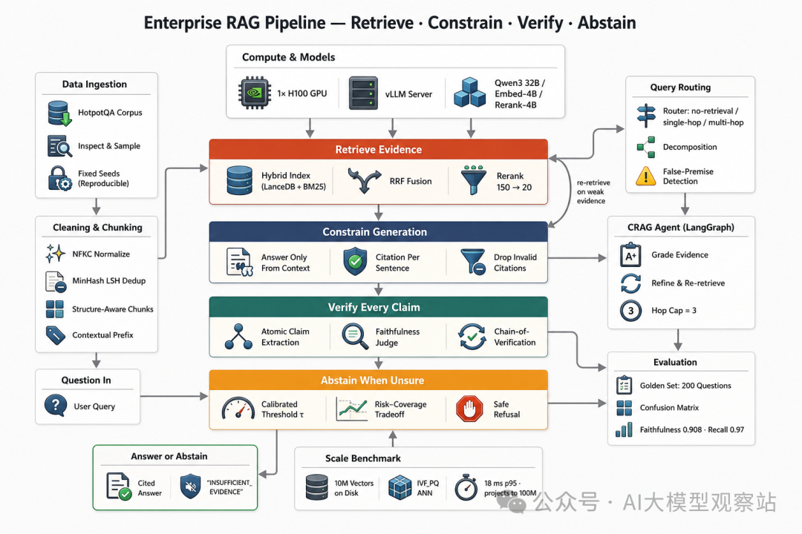

下面是这条 pipeline 包含的全部内容，我们会从上到下、一次构建一个组件：

- **设置并获取数据**：下载语料库，检查其规模和真实样本，并固定所有 seed，确保运行可复现。
- **清洗和切块**：规范化文本，用 MinHash LSH 去除近似重复，并将其切成结构感知的 chunks，带一行 context prefix。
- **构建 hybrid index**：把每个 chunk 作为 dense vector 存入 LanceDB，同时存一份 sparse BM25 posting，落盘以扩展到 1000 万+ vectors。
- **检索和 rerank**：用 reciprocal rank fusion 融合 dense 和 sparse 排名，然后把 150 个候选 rerank 到 20 个。
- **路由和分解**：对每个问题分类，并在检索前将 multi-hop 问题拆成 sub-questions。
- **带引用生成**：严格基于 context 回答，每个句子都带 citation，或者输出 abstain token。
- **验证每个 claim**：把答案拆成 atomic claims，并用 faithfulness judge 对照其引用文本检查每个 claim。
- **不确定时拒答**：把各种信号合并成一个校准后的决策，在支持不足时拒绝回答。
- **连接 agent**：把所有组件接成一个自我纠错的 CRAG loop，在证据薄弱时重新检索。
- **评估和扩展**：在 200 个问题的 golden set 上给 hallucination 打分，然后把 index benchmark 到真实的 1000 万 vectors，并外推到 1 亿。

所有代码都在我的 GitHub 仓库中（Theory + Code）：

https://github.com/FareedKhan-dev/rag-zero-hallucinations

## 目录

- 近零，不是零
- 设置项目
- 获取数据
- 清洗语料库
- Chunking 和 Context
- 加载检索模型
- 构建 Hybrid Index
- Reciprocal rank fusion
- Routing 和 Decomposition
- 带引用生成
- Verification Gate
- 知道何时拒答
- Agent
- 它有效吗？
- Golden set
- 幻觉存在于一个单元格中
- 安全性的代价
- Judge 够好吗？
- 扩展到 1000 万+ Vectors
- 一个真实的 1000 万 vector index
- 1000 万时 18 ms，以及 1 亿的外推
- 时间花在哪里
- 范围和下一步

## 近零，不是零

我们要解决的问题不是“让模型更聪明”。更大的模型在 retrieval 返回空结果时仍然会猜，因为猜测正是 generation 会做的事。

所以，与其追逐一个完美模型，不如把一个普通模型包进一个只有一种安全失败模式的系统中。当证据缺失时，正确输出不是流畅的猜测，而是 abstention。

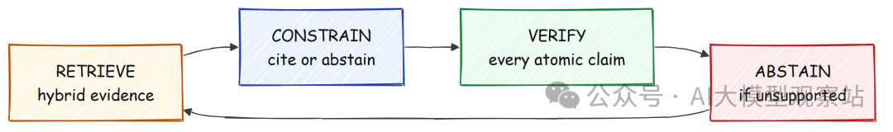

这给了我们四层控制，下面的每一节都是其中一层。

1. **检索正确证据**：hybrid dense 加 BM25 search、contextual chunks 和 reranking。
2. **约束生成**：只基于 context 回答，为每个句子引用 passage ids，或者拒答。
3. **验证每个 atomic claim**：用 faithfulness judge 对照引用文本检查每个 claim。
4. **拒答**：当 claim support 或 retrieval confidence 低于校准阈值时拒答。

我们同时追求两个目标。第一个是 **trust**，也就是在我们选择回答的问题上实现近零 hallucination。

第二个是 **scale**，也就是 retrieval backbone 必须容纳 1000 万+ vectors，并且仍能在毫秒级回答。第一个目标需要 verification logic，第二个目标需要 index。

两者我们都会构建。

## 设置项目

在任何逻辑之前，我们先设置项目。计划是导入库，固定所有随机 seed 以保证运行可复现，检查拿到的唯一 GPU，把一个轻量 client 指向 generator，并冻结 config，让 headless run 每次行为一致。

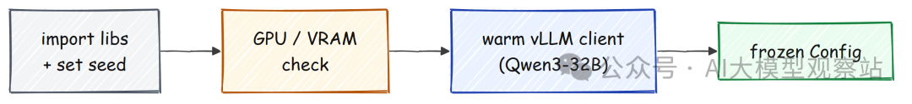

首先是 imports，以及一个为我们会触碰到的每个随机数生成器设置 seed 的函数。

```
import json, os, random, subprocess, time
from dataclasses import dataclass, asdict, field
import numpy as np


def set_determinism(seed: int) -> None:
    """Seed every RNG we touch so runs are reproducible."""
    random.seed(seed)
    np.random.seed(seed)
    os.environ["PYTHONHASHSEED"] = str(seed)
    try:
        import torch
        torch.manual_seed(seed)
        torch.cuda.manual_seed_all(seed)
    except Exception:
        pass


set_determinism(42)
```

我一开始就固定 seed，因为不可复现的 RAG evaluation 就不是 evaluation，也因为这篇博客的核心是信任最后的数字。这个 notebook 也是参数化的，所以一个 cell 会解析 run profile，并打印我们即将基于什么来构建。

```
#### OUTPUT ####
profile=FULL  slice=20000  eval=100+100  artifacts=/mnt/data/artifacts
```

这是 full run，2 万个 passages 和 100 加 100 个 evaluation questions，而不是我最开始用来低成本排查代码错误的小型 smoke profile。我们在单张 GPU 上，所以 VRAM 是硬预算，而不是运行时惊喜。我们用 `nvidia-smi` 读取显卡，并断言它符合预期。

```
def gpu_report() -> dict:
    """Return GPU name / memory / driver and assert we are on an 80GB H100."""
    name = _smi("name")[0]
    total = float(_smi("memory.total")[0]) / 1024.0          # GiB
    rep = {"name": name, "total_gb": round(total, 1),
           "free_gb": round(float(_smi("memory.free")[0]) / 1024.0, 1),
           "driver": _smi("driver_version")[0]}
    print(json.dumps(rep, indent=2))
    assert "H100" in name and total >= 79      # one 80GB H100, nothing smaller
    return rep
```

```
#### OUTPUT ####
{
  "name": "NVIDIA H100 PCIe",
  "total_gb": 79.6,
  "free_gb": 32.8,
  "driver": "570.195.03"
}
```

我们用的是一张 **80 GB 的 NVIDIA H100**，主机还有 180 GB RAM 和 750 GB NVMe disk，后面 index 变大时这点很重要。32B generator 不在这个 notebook 进程里。

它运行在一个单独的 vLLM server 中，我们用一个小型 OpenAI-compatible client 与它通信。让它在自己的进程中保持 warm，意味着我们可以反复重新运行这个 notebook，而无需重新加载它。

```
class LocalLLM:
    """Thin client for the warm vLLM OpenAI-compatible server."""

    def __init__(self, endpoint: str, model: str, thinking: bool = False):
        self.endpoint, self.model, self.thinking = endpoint.rstrip("/"), model, thinking

    def chat(self, system: str, user: str, temperature: float = 0.0, max_tokens: int = 512) -> str:
        body = {"model": self.model, "temperature": temperature, "max_tokens": max_tokens,
                "messages": [{"role": "system", "content": system},
                             {"role": "user", "content": user}]}
        if not self.thinking:                   # Qwen3: skip the <think> trace for low latency
            body["chat_template_kwargs"] = {"enable_thinking": False}
        r = requests.post(f"{self.endpoint}/chat/completions", json=body, timeout=120)
        r.raise_for_status()
        return r.json()["choices"][0]["message"]["content"]


llm = LocalLLM("http://localhost:8000/v1", "Qwen/Qwen3-32B")
print(f"[llm] up={llm.is_up()}")
```

```
#### OUTPUT ####
[llm] up=True
```

server 已经启动。最后一个 setup 步骤是把所有旋钮冻结到一个 config object 中并打印出来，这样驱动博客其余部分的数字都集中在一个地方。

```
#### OUTPUT ####
{
  "gen_model": "Qwen/Qwen3-32B",
  "embed_offline": "Qwen/Qwen3-Embedding-4B",
  "rerank_model": "Qwen/Qwen3-Reranker-4B",
  "chunk_tokens": 256, "chunk_overlap": 32,
  "retrieve_k": 150, "rerank_top_n": 20, "rrf_k": 60,
  "max_hops": 3, "crag_ok": 0.7, "crag_bad": 0.4,
  "tau_claim": 0.3, "tau_abstain": 0.3, "seed": 42
}
```

我们检索 150 个候选，rerank 到 20 个，允许 agent 最多进行 3 次 corrective hops，并把两个 support thresholds 设为 0.3，后面会校准它们。generator 是 **Qwen3–32B**，embedder 和 reranker 是 4B Qwen3 models，faithfulness judge 则是 32B 本身。

我把 generator 设为 temperature 0，并关闭 thinking trace，因为我想要可复现、低延迟的答案，也因为 sampling 又多了一个模型可能偏离我给它的证据的位置。这里每个模型都是本地 open-weight Qwen3，这么做是因为整个前提是没有任何 document 和 query 会离开这台机器，而这正是让这样的 pipeline 能用于 private corpus 的原因。

工具准备好了，我们就可以去拿数据了。

## 获取数据

pipeline 的好坏取决于其底层语料库，所以第一个真正的步骤是下载一个 dataset 并查看它。我选择了 **HotpotQA** 的 distractor setting，原因有两个。

每个问题都带有 sentence-level gold supporting facts，这是后面评估 retrieval recall 最干净的方式；同时它捆绑的 Wikipedia paragraphs 免费给了我一个真实语料库。测试的另一侧，我拉取 **SQuAD v2** impossible questions，并手写少量 false-premise questions，因为衡量 hallucination 的唯一方式，就是问语料库无法回答的问题，并检查系统是否保持沉默。

第三个集合 **HaluBench** 会在接近结尾时出现，只用于验证 verifier 本身。HotpotQA 是我们构建和搜索的语料库。

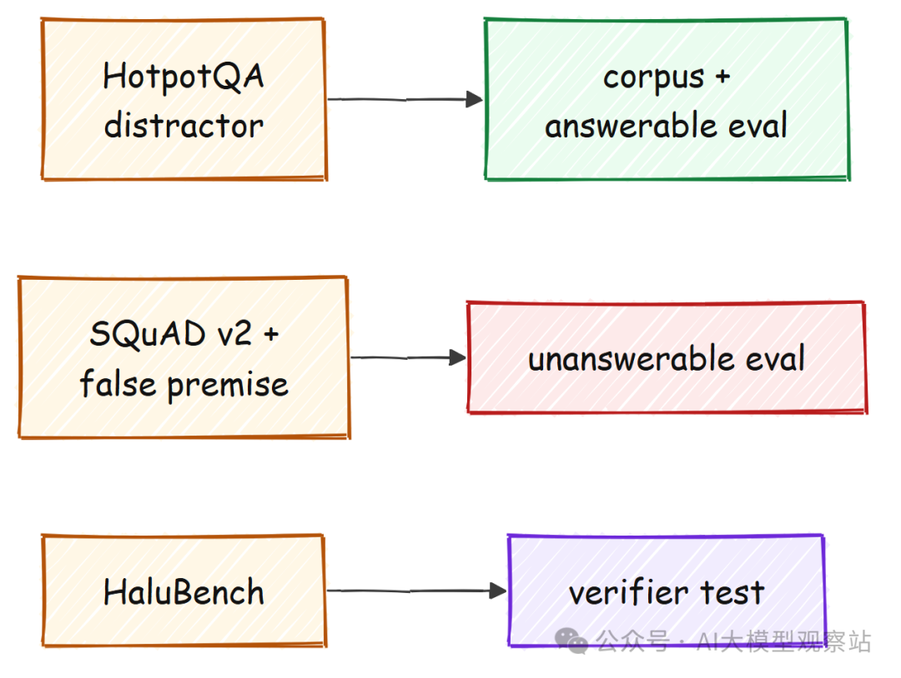

```
from datasets import load_dataset

def load_hotpotqa(split: str = "validation"):
    # datasets 3.x wants the namespaced repo id
    return load_dataset("hotpotqa/hotpot_qa", "distractor", split=split, cache_dir=DS_CACHE)

hotpot = load_hotpotqa()
print(f"[data] hotpotqa(validation) = {len(hotpot)} questions")
```

```
#### OUTPUT ####
[data] hotpotqa(validation) = 7405 questions
```

也就是 **7,405 个问题**，每个问题都捆绑着它来源的 Wikipedia paragraphs。我们定义 passage 和 question 的形态，然后写一个 builder，把每个问题的 context paragraphs union 成一个 corpus，同时记录哪些 passages 是 gold evidence。

```
@dataclass
class Passage:
    id: str
    title: str
    text: str
    is_gold_for: list[str] = field(default_factory=list)   # question ids this is gold for

@dataclass
class QAItem:
    qid: str
    question: str
    answer: str
    answerable: bool
    gold_titles: list[str] = field(default_factory=list)
    gold_sentences: list[str] = field(default_factory=list)
    qtype: str = ""    # bridge | comparison | unanswerable | false_premise
```

```
class CorpusBuilder:
    """Build a passage corpus + QA items from HotpotQA distractor contexts."""

    def build(self, qa, n_passages: int):
        passages, qa_items = {}, []
        for ex in qa:
            gold = list(dict.fromkeys(ex["supporting_facts"]["title"]))   # gold evidence titles
            for t, ss in zip(ex["context"]["title"], ex["context"]["sentences"]):
                para = " ".join(s.strip() for s in ss).strip()
                if len(para) < 40:
                    continue
                p = passages.setdefault(_pid(t, 0), Passage(_pid(t, 0), t, para))
                if t in gold:
                    p.is_gold_for.append(ex["id"])
            # (the full builder also records each question's gold supporting sentences)
            qa_items.append(QAItem(ex["id"], ex["question"], ex["answer"], True,
                                   gold_titles=gold, qtype=ex.get("type", "")))
            if len(passages) >= n_passages:
                break
        return list(passages.values()), qa_items

corpus, qa_items = CorpusBuilder().build(hotpot, SLICE_SIZE)
print(f"[corpus] passages={len(corpus)}  qa_items={len(qa_items)}  "
      f"gold-bearing passages={sum(1 for p in corpus if p.is_gold_for)}")
```

```
#### OUTPUT ####
[corpus] passages=20007  qa_items=2073  gold-bearing passages=4072
```

我们现在有 **20,007 个 passages** 和 2,073 个问题，其中 4,072 个 passages 被标记为某些问题的 gold evidence。在此之上构建任何东西之前，我们应该真正看看数据，包括大小分布和一个真实示例。

```
import pandas as pd

tok_lens = [len(p.text.split()) for p in corpus]
print(pd.Series(tok_lens, name="passage_word_count").describe().round(1).to_string())

ex = qa_items[0]
print(f"\nSample question:\n  Q: {ex.question}\n  A: {ex.answer}   (type={ex.qtype})")
print(f"  gold titles: {ex.gold_titles}")
for s in ex.gold_sentences:
    print(f"   - {s}")
```

```
#### OUTPUT ####
count    20007.0
mean        89.2
std         53.4
min          7.0
25%         54.0
50%         80.0
75%        113.0
max       1378.0

Sample question:
  Q: Were Scott Derrickson and Ed Wood of the same nationality?
  A: yes   (type=comparison)
  gold titles: ['Scott Derrickson', 'Ed Wood']
   - Scott Derrickson (born July 16, 1966) is an American director, screenwriter and producer.
   - Edward Davis Wood Jr. was an American filmmaker, actor, writer, producer, and director.
```

passages 平均约 **89 个词**，短到几个可以放进一个 prompt，又长到足以承载一个 fact。这个样本是一个 comparison question：“Were Scott Derrickson and Ed Wood of the same nationality?”，它的两个 gold sentences 已经包含答案：两人都是 American。

这就是我们将在整篇博客中跟踪的问题，因为看一个真实问题穿过整个 pipeline，会让每个组件变得具体。这里已经可以看到两个 strata。

像这样 answerable questions 能让我衡量正确证据是否被检索回来，而后面加入的 unanswerable questions 则是我衡量 hallucination 的方式，因为一个系统如果回答语料库中没有支持的问题，就是在编造内容。

## 清洗语料库

Garbage in 意味着 hallucinations out，所以在 index 任何东西之前，我们先清洗文本。两个廉价步骤带来的收益远超成本。Normalization 让 tokenizer 在每个 passage 上表现一致，而 near-duplicate removal 阻止复制或转发过的 passages 挤占 top results，并在没有增加任何新证据的情况下虚高 retrieval。

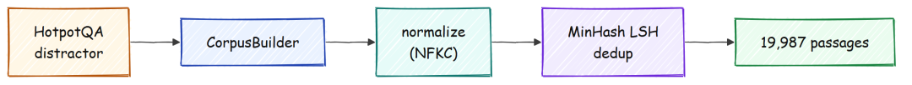

```
import re, unicodedata

def normalize_text(s: str) -> str:
    s = unicodedata.normalize("NFKC", s)     # canonical unicode form
    s = s.replace("­", "")              # drop soft hyphens
    s = re.sub(r"[ \t]+", " ", s)            # collapse runs of spaces
    return s.strip()
```

我先运行 NFKC normalization，因为 BM25 基于原始字符 tokenize，所以一个 ligature 或一串多余空格会悄悄把一个词拆成两个，或把两个词合成一个，并损害 recall。在一个 messy string 上，这个函数正好做了我们想要的事。

```
#### OUTPUT ####
>>> normalize_text("the  final   report\twas   ready")
'the final report was ready'
```

ligature “fi” 变成普通的 “fi”，tab 和连续空格折叠成单个空格，所以两个只在不可见字符上不同的 passages 现在会被 tokenize 成同样的形式。

deduper 是有趣的部分。我必须选择 MinHash LSH 这样的近似方法，而不是比较每一对，因为精确 pairwise comparison 是二次复杂度，在语料库规模下永远跑不完，而带 LSH index 的 MinHash 能以近似线性时间找到 near-duplicates。

删除它们同时服务两个目标。它让我们迈向 1000 万 vectors 时 index 更小，也防止同一个 paragraph 的三份副本挤满 top results，这是一种 retriever 向模型喂入冗余 context 并诱使其过度信任单一来源的隐蔽方式。

```
class Deduper:
    """Drop near-duplicate passages via MinHash LSH over word shingles."""

    def __init__(self, threshold: float = 0.9, num_perm: int = 64):
        self.threshold, self.num_perm = threshold, num_perm

    def fit_transform(self, passages: list[Passage]):
        lsh = MinHashLSH(threshold=self.threshold, num_perm=self.num_perm)
        kept, dropped = [], 0
        for p in passages:
            m = self._mh(p.text)
            if lsh.query(m):              # a near-duplicate is already kept
                dropped += 1
                continue
            lsh.insert(p.id, m)
            kept.append(p)
        return kept, {"kept": len(kept), "dropped_near_dup": dropped}
```

```
#### OUTPUT ####
{
  "kept": 19987,
  "dropped_near_dup": 19,
  "input": 20007,
  "after_quality": 20006,
  "after_dedup": 19987
}
```

删除 19 个近似重复和 1 个短片段后，我们保留 **19,987 个 passages**。这个 corpus 是一个 curated slice，但清洗步骤完全一样，无论输入是 2 万个 passages 还是 2000 万个。

## Chunking 和 Context

现在我们把 passages 切成 chunks。Fixed-size chunking 是简单选择，也是错误选择，因为它会把包含 entity 的句子从用于消歧的 context 中切开，这对 multi-hop questions 是致命的。

因此我们把完整句子打包到 token budget 内，带少量 overlap，并用 generator 自己的 tokenizer 计算 tokens，这样 budget 就和模型实际会看到的内容一致。这是一个隐藏在 chunking 细节里的 hallucination 问题。

如果一个 chunk 超出 budget 后被静默截断，包含答案的那一句可能会消失，于是问题看起来无缘无故地变成 unanswerable，所以我宁愿尊重句子边界，并为多出的一些 chunks 付出成本。

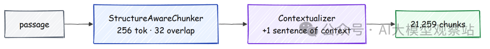

```
class StructureAwareChunker:
    def __init__(self, tokenizer, target_tokens: int = 256, overlap: int = 32):
        self.tok, self.target, self.overlap = tokenizer, target_tokens, overlap

    def chunk(self, passage: Passage) -> list[Chunk]:
        sents = split_sentences(passage.text) or [passage.text]
        chunks, cur, cur_tok = [], [], 0
        for s in sents:
            st = self._ntok(s)
            # start a new chunk once adding this sentence would blow the token budget
            if cur and cur_tok + st > self.target:
                chunks.append(self._make(passage, cur))
                # carry the trailing sentence forward so chunks overlap
                cur, cur_tok = ([cur[-1]], self._ntok(cur[-1])) if self.overlap else ([], 0)
            cur.append(s)
            cur_tok += st
        if cur:
            chunks.append(self._make(passage, cur))
        return chunks
```

```
#### OUTPUT ####
[chunk] 19987 passages -> 21259 chunks  (tokens: mean=125 p95=236)
```

这给了我们 **21,259 个 chunks**，平均 125 tokens，舒适地低于 256 budget。indexing 之前还有一个问题需要解决。

像“revenue grew 3 percent that quarter”这样的 chunk 本身不可检索，因为是谁的 revenue、哪个 quarter 都没了。所以我们在 indexing 前给每个 chunk 前面添加一句定位性的句子，这就是 contextual retrieval 思路，只不过我们用本地 Qwen3 而不是 hosted model 来写这句话。

```
CONTEXTUALIZE_PROMPT = (
    "Here is a document titled '{title}':\n<document>\n{doc}\n</document>\n\n"
    "Here is a chunk from it:\n<chunk>\n{chunk}\n</chunk>\n\n"
    "Give a short, single-sentence context (<=25 words) that situates this chunk "
    "within the document so it can be retrieved on its own. Answer with the sentence only."
)
```

这个方法把 per-chunk calls 分发到 thread pool，因为这些调用彼此独立，vLLM 会在 server-side 对它们 batch，这比逐个 chunk 处理快得多。我们还会 checkpoint 结果，所以 rerun 会跳过整个步骤。

```
class Contextualizer:
    def contextualize(self, chunks, doc_lookup, workers: int = 32):
        def _one(c):
            user = CONTEXTUALIZE_PROMPT.format(title=c.title,
                                               doc=doc_lookup.get(c.passage_id, c.text)[:4000],
                                               chunk=c.text)
            ctx = self.llm.chat("You write concise retrieval context.", user, max_tokens=64).strip()
            c.contextual_text = (ctx + "\n" + c.text) if ctx else c.text   # prefix, keep original
        with ThreadPoolExecutor(max_workers=workers) as ex:
            list(ex.map(_one, chunks))      # 32 in flight at once
        return chunks
```

```
#### OUTPUT ####
Before:
  Ed Wood is a 1994 American biographical period comedy-drama film directed and
  produced by Tim Burton, and starring Johnny Depp as cult filmmaker Ed Wood...

After (context-prefixed):
  This chunk introduces the 1994 film *Ed Wood*, directed by Tim Burton, and
  outlines its main subject and cast.
  Ed Wood is a 1994 American biographical period comedy-drama film...
```

这句额外的句子很便宜，每个 chunk 只需一次短 generation，并且它会告诉 retriever 这个 chunk 关于什么，即使 chunk text 本身可能有歧义。这种提升是 recall 最终如此高的大部分原因。Recall 是整个 hallucination 故事的基础，因为 downstream verifier 只能把答案 ground 在 retrieval 实际找到的证据上，所以我在这里买到的每一点 recall，都是一个我可以回答而不是拒绝的问题。

## 加载检索模型

chunks 准备好后，我们加载把它们变成可搜索证据、并在之后检查答案的模型。三个模型与 generator 共享这块 GPU，所以我们在每次 load 后 snapshot VRAM，并保持在预算内。这里加载 **reranker** 和 **faithfulness judge**，embedder 稍后在构建 index 时再加载。

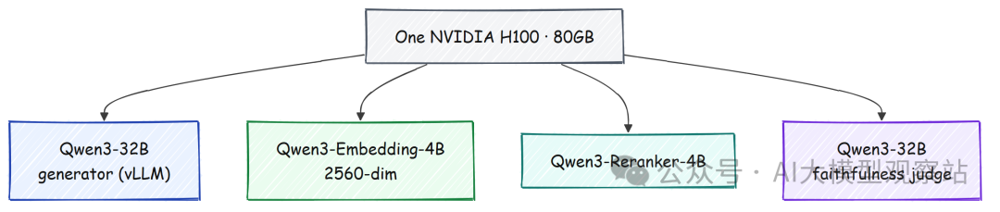

我们不想三步之后才通过 out-of-memory crash 发现超预算，所以每次 load 都记录来自 `nvidia-smi` 的整卡数值，以及来自 torch 的 kernel-only 数值。

```
def vram_snapshot(tag: str) -> dict:
    """Log GPU-wide and kernel-only VRAM after each load step."""
    kernel = round(torch.cuda.memory_allocated() / 1024**3, 2)     # this kernel only
    used = round(float(_smi("memory.used")[0]) / 1024.0, 2)        # whole GPU, both processes
    print(f"[vram] {tag:22} gpu_used={used}GB  kernel={kernel}GB")
    return {"tag": tag, "gpu_used_gb": used, "kernel_gb": kernel}
```

reranker 是一个小型 causal model，用作 yes-or-no judge。每个 query 和 document pair 都被包装进固定 template，score 直接从 next-token logits 读取，所以 reranking 对每个候选只需要一次 forward pass。我加载一个专用 cross-encoder reranker，而不是相信 embedding scores，因为 embedder 会把整个 passage 压缩成一个 vector，这足够快，可以扫描语料库，但会模糊“只是提到 entities 的 passage”和“真正回答问题的 passage”之间的差别，而这个差别正是让错误证据远离 prompt 和答案的关键。

```
class Qwen3Reranker:
    """Scores a (query, doc) pair by the probability the model puts on the 'yes' token."""

    @torch.no_grad()
    def score(self, query: str, docs: list[str], batch_size: int = 16) -> list[float]:
        out = []
        for i in range(0, len(docs), batch_size):
            batch = [self._fmt(query, d) for d in docs[i:i + batch_size]]
            enc = self.tok(batch, return_tensors="pt", padding=True,
                           truncation=True, max_length=1024).to(self.model.device)
            logits = self.model(**enc).logits[:, -1, :]       # last-token logits
            yn = logits[:, [self.no_id, self.yes_id]]         # compare 'no' against 'yes'
            probs = torch.softmax(yn.float(), dim=-1)[:, 1]   # keep P('yes')
            out.extend(probs.cpu().tolist())
        return out
```

faithfulness judge 是 32B generator 本身，通过 prompt 返回一个 claim 对某段 context 的单一 support score。我选择本地 32B 作为 judge，是因为 RAG 中的 faithfulness checking 意味着同时阅读一个 claim 和几段长 passages，这正是小型 sentence-pair NLI model 容易脆弱的地方；也因为这个 judge 是把 confident wrong answer 变成 abstention 的单一组件。

它是 near-zero hallucination claim 的核心，所以我宁愿把最强的模型用在这里。NLI cross-encoder 和 MiniCheck 仍作为轻量替代方案接入，但这次 run 使用 LLM judge。

```
JUDGE_PROMPT = (
    "You are a strict fact-checker. Decide whether the CONTEXT supports the CLAIM.\n\n"
    "CONTEXT:\n{context}\n\nCLAIM: {claim}\n\n"
    "Output ONLY a number: 1.0 if the context clearly states or entails the claim, "
    "0.0 if it contradicts or does not mention it, or a value in between."
)

class JudgeVerifier:
    def _score(self, claim: str, context: str) -> float:
        out = self.llm.chat("You are a strict faithfulness grader.",
                            JUDGE_PROMPT.format(context=context[:6000], claim=claim), max_tokens=8)
        m = re.search(r"[01](?:\.\d+)?", out)
        return min(1.0, float(m.group())) if m else 0.0
```

```
#### OUTPUT ####
[vram] reranker               gpu_used=54.3GB  kernel=7.49GB
[verifier] using the local LLM as faithfulness judge
[vram] whole-GPU used=54.3GB / 80.0GB (need >= 3.0GB headroom)
```

整个 stack 占用 H100 的 80 GB 中的 **54.3 GB**，为接下来的 index 工作留下了余量。judge 不需要额外 VRAM，因为它复用已经在 vLLM server 中运行的 generator。所有东西都留在一台机器上，没有任何内容访问外部 API。

## 构建 Hybrid Index

现在开始 indexing，这里的问题是没有单一 retriever 足够好。Dense embeddings 能捕捉 paraphrase，这正是当 question 和 answer 使用不同词语时你想要的能力。

BM25 捕捉 names、ids 和 numbers 这样的 exact tokens，而这些正是 dense models 会模糊的东西。所以我们对二者都建立 index，以 chunk id 为 key，作用于 contextualized text。

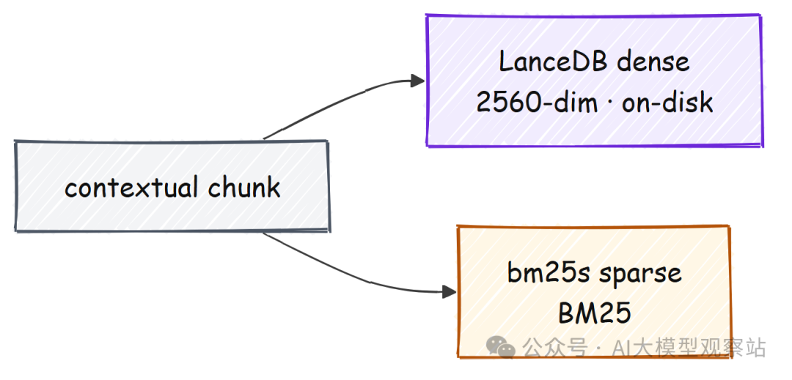

我们只在 indexing 时加载 embedder，embed 每个 chunk，然后在用更小的 online embedder 提供查询服务之前释放它。vectors 会被 normalized，所以 cosine similarity 就是普通 dot product。

```
def embed_texts(embedder, texts, is_query: bool = False) -> np.ndarray:
    kw = {"normalize_embeddings": True, "convert_to_numpy": True, "batch_size": 64}
    if is_query:                       # Qwen3-Embedding wants a query instruction prompt
        kw["prompt_name"] = "query"
    return embedder.encode(texts, **kw).astype("float32")
```

加载 query embedder 是最后一个推高 VRAM 的步骤，snapshot 显示最终落点。

```
#### OUTPUT ####
[vram] embedder(online)       gpu_used=61.85GB  kernel=15.04GB
```

峰值约为 80 GB 中的 62 GB，仍在预算内，并且我会在 indexing 后立即释放更重的 offline embedder，这样查询时只有小型 online embedder 常驻。我必须为 dense side 选择 LanceDB，因为它是 embedded、on-disk、基于 NVMe 且不需要运行 server，这意味着同一条 code path 可以承载远大于 RAM 的 index，而正是这个属性让该设计后面无需改一行代码就能达到 1000 万+ vectors。

dense side 是对它的一个薄 wrapper。唯一的细节是把 cosine distance 转回零到一范围内的 similarity。

```
class LanceVectorStore:
    def search(self, qvec: np.ndarray, k: int) -> list[tuple[str, float]]:
        res = self.tbl.search(qvec).metric("cosine").limit(k).to_list()
        # cosine _distance is in [0, 2], so convert it to a similarity in [0, 1]
        return [(r["id"], 1.0 - r["_distance"] / 2.0) for r in res]
```

我在 vectors 旁边保留一个 lexical bm25s index，因为 dense embeddings 恰好会把 rare name、id 或 number 模糊到邻近内容中，而 factual question 往往就取决于这些 tokens，所以 sparse side 是我防止 confident answer 建立在 near-miss passage 上的保险。sparse side 会以与 documents 相同的方式 stem query，然后按 BM25 score 返回 top matches。

```
class BM25Index:
    def search(self, query: str, k: int) -> list[tuple[str, float]]:
        q = bm25s.tokenize(query, stemmer=self.stemmer)
        idx, scores = self.retriever.retrieve(q, k=min(k, len(self.ids)))
        return [(self.ids[int(i)], float(s)) for i, s in zip(idx[0], scores[0])]
```

```
#### OUTPUT ####
[index] LanceDB on-disk: /mnt/data/artifacts/lancedb  |  bm25 over 21259 chunks
```

这 21,259 个 chunks 的整个 index 在磁盘上约 **11.1 MB**，非常小，但重点是形状而不是大小。LanceDB 把 vectors 放在 NVMe 上，而不是 RAM 中，所以同一条 code path 可以承载远大于内存的 index。这就是博客最后把设计推到 1000 万 vectors 时依赖的属性。

## 检索：Fusion 和 Reranking

### Reciprocal rank fusion

我们现在有两个 ranked lists，一个 dense，一个 sparse，必须把它们组合起来。陷阱在于它们的 scores 不可比较，因为 BM25 score 和 cosine similarity 处在不同尺度上。

Reciprocal rank fusion 完全绕开这个问题。它忽略 scores，只使用 rank，给每个 result 一个 1 除以 k 加 rank 的权重，然后在两个 lists 上把这些权重相加。

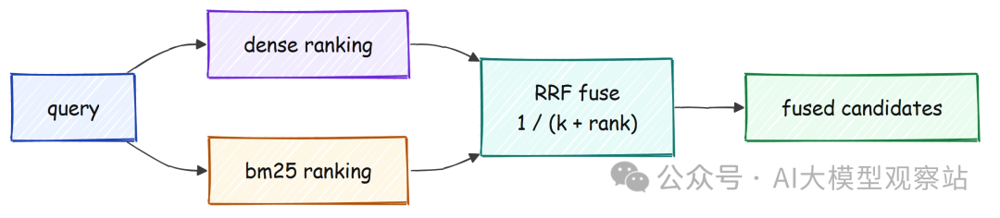

```
def rrf_fuse(rankings: list[list[str]], k: int = 60) -> list[tuple[str, float]]:
    scores: dict[str, float] = {}
    for ranking in rankings:
        for rank, cid in enumerate(ranking):
            # a later rank adds less, and no score normalization is needed
            scores[cid] = scores.get(cid, 0.0) + 1.0 / (k + rank + 1)
    return sorted(scores.items(), key=lambda x: -x[1])
```

它看起来比描述起来更容易。拿两个短 rankings，其中 dense list 和 sparse list 意见不同，然后观察 fusion 做了什么。

```
#### OUTPUT ####
>>> rrf_fuse([["a", "b", "c"], ["b", "c", "a"]])
[('b', 0.03252), ('a', 0.03227), ('c', 0.03200)]
```

document `b` 获胜，尽管没有任何一个 list 把它排第一，因为它在两个 list 中都靠前。这就是全部要点。

两个不同 retrievers 都同意的 result，会排在只有一个 retriever 很喜欢的 result 之上。我们之所以要 fusion，是因为这两个 retrievers 的失败方式不同。

Dense search 会漏掉一个在 embedding space 中不靠近任何已见内容的 rare proper noun，而 sparse search 会漏掉一个与 query 没有共享词的 paraphrase，所以融合它们可以找回单独使用任一 retriever 都会丢掉的 documents。retriever 将它们连接起来：embed query 一次，以相同宽度运行两种 search，然后把两个 id rankings 融合成一个。

```
class HybridRetriever:
    def retrieve(self, query: str, k: int) -> list[RetrievedChunk]:
        qvec = embed_texts(self.embedder, [query], is_query=True)[0]
        dense = self.vec.search(qvec, k)        # dense catches paraphrase and meaning
        sparse = self.bm25.search(query, k)     # sparse catches exact names, ids, numbers
        fused = rrf_fuse([[i for i, _ in dense], [i for i, _ in sparse]], self.rrf_k)[:k]
        return [c for c in (self._mk(cid, s, "hybrid") for cid, s in fused) if c]
```

fused list 是我们的 recall stage，故意做宽到 150 个候选，因为下一阶段才是我们用 recall 换 precision 的地方。

### Reranking

Recall 便宜，precision 昂贵，所以我们按这个顺序运行。前面加载的 reranker 会一起阅读 query 和 candidate，并给出它们匹配程度的 score，这比 bi-encoder embeddings 准确得多，但也慢得多，无法在整个 corpus 上运行。

只在 150 个 fused candidates 上运行它是甜点区。把昂贵模型运行在 150 个候选上而不是整个 corpus 上，也是一个 scaling decision，因为无论 index 包含 2 万 chunks 还是 1000 万 chunks，这个成本都固定为 150 个 pairs。

一个薄 stage 包装该模型，给每个候选打分，并保留 top twenty。

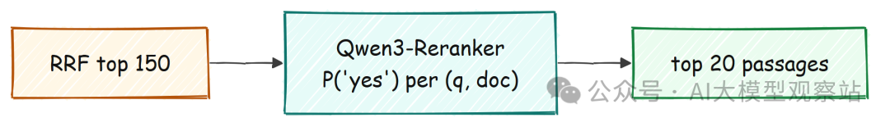

```
class RerankerStage:
    def rerank(self, query, cands, top_n):
        scores = self.reranker.score(query, [c.text for c in cands])
        ranked = sorted(zip(cands, scores), key=lambda x: -x[1])[:top_n]
        out = []
        for c, s in ranked:
            c.score, c.source = float(s), "reranked"
            out.append(c)
        return out
```

我们可以通过对照 HotpotQA gold titles 衡量 passage recall，来证明 dense alone、hybrid、再到 reranked 的提升，用我们正在跟踪的例子来展示。

```
#### OUTPUT ###
Q: Were Scott Derrickson and Ed Wood of the same nationality?
 gold titles: ['Scott Derrickson', 'Ed Wood']
 recall@20:  dense=1.00  hybrid=1.00  reranked=1.00
 top-3 reranked:
   [a9ec406223bd] (0.999) Scott Derrickson
   [2d2201c92ac5] (0.996) Ed Wood
   [b7dbb0e190b4] (0.796) Ed Wood (film)
```

两个 gold passages 都进入 top three，reranker scores 分别为 0.999 和 0.996，而相关性较弱的电影条目以 0.796 排在更后。整个 evaluation 中，这套 retrieval stack 达到 **0.97 context recall**，这意味着当问题 answerable 时，证据几乎总是在那里。

Retrieval 解决了。后面的一切都是关于不滥用它。

## Routing 和 Decomposition

不是每个 query 都值得走完整 pipeline。问候不需要 retrieval，简单 lookup 需要一个 hop，comparison 需要多个。因此 agent 做的第一件事，是把问题 route 到三个 labels 之一，这样我们只在有帮助的地方花费 compute。

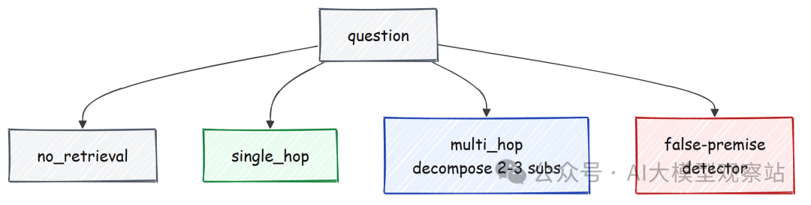

```
ROUTER_PROMPT = (
    "Classify the question into exactly one label:\n"
    "- no_retrieval: greetings/opinions or questions no document corpus could answer\n"
    "- single_hop: answerable by finding one fact\n"
    "- multi_hop: needs combining facts from multiple documents\n"
    "Question: {q}\nReply with only the label."
)

class QueryRouter:
    LABELS = {"no_retrieval", "single_hop", "multi_hop"}

    def route(self, query: str) -> str:
        out = self.llm.chat("You are a precise query classifier.",
                            ROUTER_PROMPT.format(q=query), max_tokens=8).strip().lower()
        for lbl in self.LABELS:
            if lbl in out:
                return lbl
        return "single_hop"                 # a safe default if the model is chatty
```

decomposer 和 false-premise check 一样小。decomposer 要求返回两个或三个 self-contained sub-questions，detector 则直接问一个 yes-or-no 问题：query 是否假设了某个可能不为真的前提。

```
DECOMPOSE_PROMPT = (
    "Break this multi-hop question into 2-3 ordered, self-contained sub-questions, "
    "one per line, no numbering. If it is already simple, return it unchanged.\nQuestion: {q}"
)

def detect_false_premise(query: str, llm: LocalLLM) -> bool:
    out = llm.chat("You detect false presuppositions.",
                   FALSE_PREMISE_PROMPT.format(q=query), max_tokens=4)
    return out.strip().lower().startswith("y")
```

```
#### OUTPUT ####
route('Were Scott Derrickson and Ed Wood of the same nationality?...') -> single_hop
decompose ->
   • What is the nationality of Scott Derrickson?
   • What is the nationality of Ed Wood?
```

同一个 router 在另外两类问题上展示了其他分支。

```
#### OUTPUT ####
route('What is the best programming language?') -> no_retrieval
route('Who directed Ed Wood, and what is that director also known for?') -> multi_hop
```

一个 opinion 得到 `no_retrieval`，这本身就是一条 abstention path，因为系统会拒绝，而不是搜索一个任何 document 都不持有答案的问题。一个真正的 two-fact question 得到 `multi_hop`，这会在之后把 agent 送入 corrective loop。

router 把我们的运行示例判为 single-hop，因为 reranked passages 已经直接回答了它，而 decomposer 仍然展示了如果第一轮检索结果薄弱，它会如何把 comparison 拆成两个干净的 lookups。Routing 很便宜，只需一次短 classification call，而它的价值在于把昂贵的 retrieval 和 verification 工作从不需要它的问题上移除，这在规模化时也很重要，因为每跳过一次 retrieval，都是不花出去的 latency。

## 带引用生成

这是第一道 hallucination firewall。system prompt 禁止使用外部知识，要求每个句子都有 inline citation，并给模型一个明确 token，让它在 context 不包含答案时输出。告诉模型 cite 还不够，所以我们还会验证 citations，并删除模型编造的任何 citation。

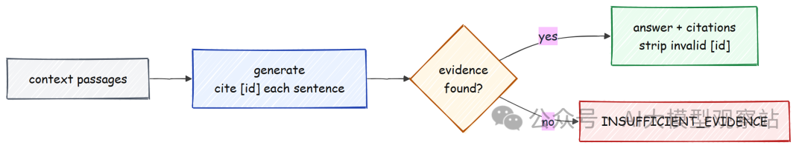

```
ABSTAIN_TOKEN = "INSUFFICIENT_EVIDENCE"
GENERATION_SYSTEM_PROMPT = (
    "You answer strictly from the numbered context passages. Rules:\n"
    "1. Use ONLY facts in the passages, never outside knowledge.\n"
    f"2. If the passages do not contain the answer, reply with exactly: {ABSTAIN_TOKEN}\n"
    "3. Every sentence MUST end with a citation to the passage id(s) it uses, like [abc123def456].\n"
    "4. Be concise and factual."
)
```

generation 之后，我们 parse citation markers，只保留与真实 chunk id 匹配的 citations，这样 fabricated citation 永远不能出现在用户面前。

```
def parse_citations(text: str, valid_ids: set[str]) -> tuple[list[str], str]:
    found = _CITE_RE.findall(text)
    valid = [c for c in dict.fromkeys(found) if c in valid_ids]
    invalid = [c for c in dict.fromkeys(found) if c not in valid_ids]
    cleaned = text
    for bad in invalid:                       # strip any citation the model invented
        cleaned = cleaned.replace(f"[{bad}]", "")
    return valid, cleaned
```

在一个引用了一个真实 passage 和一个模型编造 passage 的句子上运行它，fake citation 会直接消失。

```
#### OUTPUT ####
>>> text = "Paris is the capital of France [a1b2c3d4e5f6]. The Louvre opened in 1793 [deadbeef0000]."
>>> parse_citations(text, valid_ids={"a1b2c3d4e5f6"})
(['a1b2c3d4e5f6'], 'Paris is the capital of France [a1b2c3d4e5f6]. The Louvre opened in 1793 .')
```

valid id 保留，编造的 `[deadbeef0000]` 被移除，所以只有真实 citation 会进入下一阶段。这很重要，因为最危险的 hallucination 是一个自信句子披着它并不配拥有的 citation，而这里它在任何人看到之前就消失了。generator 会用 ids 格式化 retrieved passages，调用模型一次，然后返回 abstain signal 或一个经过解析和 citation 检查的答案。

```
class CitedGenerator:
    def generate(self, question, chunks) -> CitedAnswer:
        user = f"Context passages:\n{format_context(chunks)}\n\nQuestion: {question}\n\nAnswer:"
        raw = self.llm.chat(GENERATION_SYSTEM_PROMPT, user, max_tokens=400).strip()
        if ABSTAIN_TOKEN in raw:                          # the model chose to abstain
            return CitedAnswer(text="", cited_ids=[], abstained=True, raw=raw)
        cited, cleaned = parse_citations(raw, {c.id for c in chunks})
        return CitedAnswer(text=cleaned.strip(), cited_ids=cited, abstained=False, raw=raw)
```

```
#### OUTPUT ####
Q: Were Scott Derrickson and Ed Wood of the same nationality?
abstained=False  citations=['a9ec406223bd', '2d2201c92ac5']
A: Yes, Scott Derrickson and Ed Wood were of the same nationality; both were American. [a9ec406223bd] [2d2201c92ac5]
```

答案引用了我们检索到的两个 passages，而且两个 ids 都是真实的，所以没有东西被移除。此时我们有了一个流畅、带 citation 的答案，但 citation 只能证明模型指向了某个 passage，不能证明 passage 真的支持它说的话。

模型可能引用真实 passage，却仍然误读它，所以 citation 是必要条件但不充分。下一道 firewall 就是要关闭这个缺口。

## Verification Gate

这是决定性的 firewall。我们把 drafted answer 拆成 atomic claims，然后用前面加载的 faithfulness judge 对照其 cited context 检查每个 claim。score 低于 threshold 的 claim 是 unsupported，如果任何 claim 失败，整个答案都会降级为 abstention。

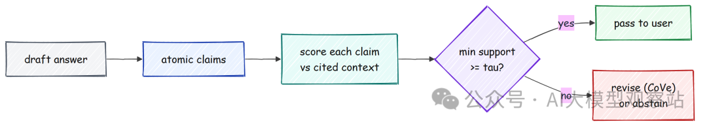

claim extractor 把答案拆成 atomic、可独立检查的 statements，先删除 citation markers，让 claims 成为干净文本。

```
class ClaimExtractor:
    def extract(self, answer: str) -> list[str]:
        clean = _CITE_RE.sub("", answer).strip()          # remove [id] markers first
        out = self.llm.chat("You extract atomic factual claims.",
                            CLAIM_DECOMP_PROMPT.format(a=clean), max_tokens=300)
        claims = [re.sub(r"^\s*\d+[.)]\s*", "", ln).strip(" -\t")
                  for ln in out.splitlines() if ln.strip()]
        return [c for c in claims if len(c) > 3]
```

gate 提取 claims，对照 cited passages 为每个 claim 打分，只有所有 claims 都超过 threshold 才通过。

```
class VerificationGate:
    def check(self, cited: CitedAnswer, chunks: list[RetrievedChunk]) -> GateResult:
        claims = self.extractor.extract(cited.text)            # split into atomic claims
        used = [c for c in chunks if c.id in set(cited.cited_ids)] or chunks
        context = "\n\n".join(c.text for c in used)
        verdicts = []
        for cl in claims:
            s = self.verifier.support(cl, context)
            verdicts.append(ClaimVerdict(cl, s["score"], s["score"] >= self.tau,
                                         s["nli"], s["minicheck"]))
        min_support = min((v.score for v in verdicts), default=0.0)
        passed = len(verdicts) > 0 and all(v.supported for v in verdicts)
        return GateResult(passed, verdicts, min_support, len(verdicts))
```

```
#### OUTPUT ####
claims=3  passed=True  min_support=1.00
   [OK 1.00] Scott Derrickson is American.
   [OK 1.00] Ed Wood is American.
   [OK 1.00] Scott Derrickson and Ed Wood share the same nationality.
```

这个一句话答案被拆成 3 个可检查的 claims，每个 claim 对照 cited passages 都得到了完整的 1.00，所以 gate 以 1.00 的 minimum support 通过。在 claim level 检查，而不是 whole answer level 检查，是让它严格的关键。

一段长答案可以有 80% grounded，却仍然夹带一个 invented fact，而 answer-level score 会放它通过；claim-level gate 则能隔离那个句子并让它失败。关键设计选择是 gate 报告的是 **weakest** claim，而不是 average，因为答案的可信度只取决于它最缺乏支持的句子。

这个 weakest-claim rule 在触发时最容易看清。下面是同一个 gate 处理某个 false-premise question 的 draft，模型曾试图配合回答。

```
#### OUTPUT ####
claims=2  passed=False  min_support=0.20
   [OK 0.95] Marie Curie was a physicist.
   [XX 0.20] Marie Curie traveled to the Moon.
```

第一个 claim 支持充分，但第二个 score 为 0.20，远低于 0.3 threshold，因为没有任何 passage 说过这种事。一个失败 claim 会把 `passed` 翻为 False，整个答案被丢弃，问题变成 abstention，而不是自信的 false statement。这正是 hallucination 被捕获并转化为安全拒答的时刻。

对于 borderline answer，我们不会直接丢弃它。chain-of-verification pass 给它一次修复机会，重写 context 不支持的任何句子并保留 citations，然后 gate 会在修订文本上再次运行。

```
COVE_PROMPT = (
    "Revise the answer so EVERY sentence is directly supported by the context. "
    "Remove or soften any claim not supported. Keep citations [id].\n\n"
    "Context:\n{ctx}\n\nAnswer:\n{ans}\n\nRevised answer:"
)

def cove_revise(answer: str, chunks, llm: LocalLLM) -> str:
    ctx = format_context(chunks)
    return llm.chat("You make answers strictly faithful to context.",
                    COVE_PROMPT.format(ctx=ctx, ans=answer), max_tokens=400).strip()
```

## 知道何时拒答

Abstention 是正确答案，不是失败，所以我们把它作为一等 outcome。这是实现 near-zero hallucination 的关键动作。

我无法阻止模型在 corpus 中没有答案的问题上出错，但我可以让系统拒绝这个问题，把一个无界失败，也就是自信的谎言，变成一个有界失败，也就是可见、可测、可调的 abstention。policy 会把信号合并成一个决策。

如果 router 判断为 no retrieval，或模型输出了 abstain token，或 verification gate 失败，我们就 abstain；否则用 verified text 回答。

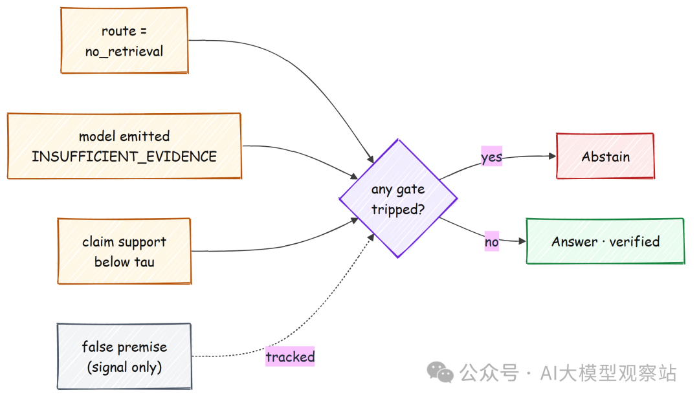

每个 outcome 都是一条严格、可审计的 record，所以 evaluation 可以无歧义地 parse answered 和 abstained。

```
@dataclass
class FinalAnswer:
    status: str               # "answered" or "abstained"
    answer: str
    citations: list[str]
    min_support: float
    reason: str               # which gate fired, or "verified"
```

```
class AbstentionPolicy:
    def decide(self, route, false_premise, cited, gate) -> FinalAnswer:
        if route == "no_retrieval":
            return self._abstain("routed_no_retrieval", gate)
        if cited.abstained:
            return self._abstain("model_abstained", gate)
        if gate is None or not gate.passed or gate.min_support < self.tau:
            return self._abstain("unsupported_claims", gate)
        return FinalAnswer("answered", cited.text, cited.cited_ids,
                           gate.min_support, "verified", {})
```

```
#### OUTPUT ####
AbstentionPolicy ready; reasons = {routed_no_retrieval, false_premise, model_abstained, unsupported_claims, verified}
```

有一个细节值得指出。false-premise flag 会作为信号记录，但不是 hard gate，因为一个小型 yes-or-no detector 噪声太大，不能单独信任。

我们让 grading 加 claim verification 组成的 evidence path 做真正决策，而当没有 passage 支持这些问题时，它无论如何都会捕获 false-premise questions。当系统 abstain 时，它返回一条朴素信息：“I do not have enough supporting evidence in the available sources to answer this confidently”，而不是猜测。

## Agent

现在我们已经构建了每个组件，所以最后一步是把它们接成一个会自我纠错的 graph，因为 hallucination 最大的单一原因就是从坏 context 中生成。这个 loop 用 LangGraph 构建，我选择它是因为 control flow 真的是一个 graph，而不是一条直线：route 可以跳过 retrieval，grade 可以 loop back through refine，verify 可以把 answer 降级成 abstention，所以我宁愿声明这些 edges，而不是把它们埋进嵌套 conditionals 中。

我们 route、retrieve，然后 grade evidence。如果 evidence 很强，就 generate；如果弱，就 refine query 并重新 retrieve，直到 hop cap；如果无望，就在从未 generate 的情况下 abstain。

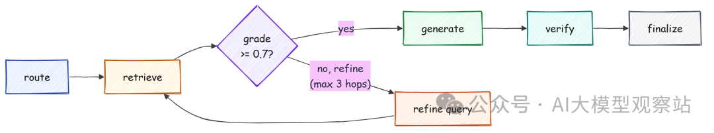

agent 在 nodes 之间传递一个 state object，一个 typed dictionary，它会累计 route、evidence、grade、draft、gate result 和运行中的 latency tally。

```
class AgentState(TypedDict, total=False):
    question: str
    route: str
    query: str
    evidence: list
    grade: float
    draft: Any
    gate: Any
    final: Any
    hops: int
    latencies: dict
```

每个 node 只做一件事。grader 给当前 passages 对 question 的回答程度打分，而 refine node 是 corrective step，它增加 hop counter，分解问题，并在再次 retrieve 前扩展 query。

```
def grade_evidence(query: str, chunks, llm: LocalLLM) -> float:
    ctx = "\n".join(f"- {c.text[:200]}" for c in chunks[:8])
    out = llm.chat("You grade retrieval sufficiency.",
                   GRADE_PROMPT.format(q=query, ctx=ctx), max_tokens=8)
    m = re.search(r"[01](?:\.\d+)?", out)
    return float(m.group()) if m else 0.5

def n_refine(state: AgentState) -> AgentState:
    state["hops"] = state.get("hops", 0) + 1
    subs = decomposer.decompose(state["question"])
    state["query"] = " ".join(subs)          # broaden the query with the sub-questions
    return state
```

一个小 routing function 把 grade 转成下一步动作，graph 用 refine step loop back 到 retrieve 的方式连接各个 nodes。

```
def _after_grade(state: AgentState) -> str:
    g = state.get("grade", 0.0)
    if g >= CRAG_OK:                       # 0.7+, the evidence is strong, answer it
        return "generate"
    if g < CRAG_BAD or state.get("hops", 0) >= MAX_HOPS:
        return "generate" if g >= CRAG_BAD else "finalize"   # too weak, abstain
    return "refine"                        # borderline, refine the query and retry


def build_agent_graph():
    g = StateGraph(AgentState)
    for name, fn in [("route", n_route), ("retrieve", n_retrieve), ("grade", n_grade),
                     ("refine", n_refine), ("generate", n_generate),
                     ("verify", n_verify), ("finalize", n_finalize)]:
        g.add_node(name, fn)
    g.set_entry_point("route")
    g.add_conditional_edges("grade", _after_grade,
                            {"generate": "generate", "refine": "refine", "finalize": "finalize"})
    g.add_edge("refine", "retrieve")       # the corrective loop
    g.add_edge("generate", "verify")
    g.add_edge("verify", "finalize")
    return g.compile()
```

在我们的运行示例上跑完整 agent，会展示每个阶段及其耗时。

```
#### OUTPUT ####
Q: Were Scott Derrickson and Ed Wood of the same nationality?
route=single_hop hops=0 grade=1.00 status=answered reason=verified
A: Yes, Scott Derrickson and Ed Wood were of the same nationality; both were American.
latencies(s): {'route': 0.16, 'retrieve': 2.4, 'grade': 0.13, 'generate': 0.94, 'verify': 0.97, 'total': 4.6}
```

grade 返回 1.00，所以 agent 直接进入 generation，最终 status 为 `answered`，reason 为 `verified`，这意味着它通过了我们构建的每一道 gate。这里 hop counter 保持为 0，但在 retrieval 薄弱时，它会爬升到 3 后才放弃。bounded loop 既让 latency 保持在预算内，也允许第二次和第三次尝试。

两行就能体现整个设计的对比。给 agent 一个 corpus 中没有答案的问题，同一个 graph 会得出相反但正确的结论。

```
#### OUTPUT ####
Q: Which programming language did Isaac Newton invent in 1700?
route=single_hop hops=0 grade=0.15 status=abstained reason=unsupported_claims
A: I do not have enough supporting evidence in the available sources to answer this confidently.
latencies(s): {'route': 0.17, 'retrieve': 2.9, 'grade': 0.14, 'total': 3.3}
```

retrieval 找不到任何关于 Newton 发明语言的内容，所以 grade 返回 0.15，低于 `crag_bad` 下限 0.4，agent 直接 finalize 到 abstention，完全不生成。这种 early exit 也是 abstain path 更快的原因：这里 3.3 秒，而 answered case 是 4.6 秒，因为一旦系统知道证据不存在，就不会在 generation 或 verification 上花费任何东西。unanswerable set 上 100 个中 98 个 abstentions，就是这样逐个问题出现的。

## 它有效吗？

### Golden set

要衡量这一切，我们需要一个有两个 strata 的 test set。answerable stratum 来自 HotpotQA，unanswerable stratum 来自 SQuAD v2 impossible questions，再加少量手工构建的 false-premise questions。

unanswerable half 是重要部分，因为普通 RAG 系统会在这里悄悄 bluff。我们构建的一切，citation rule、claim gate、abstention policy，都是为了让这一半保持沉默，所以这个 stratum 才是真正衡量 near-zero hallucination claim 的部分，而 answerable half 衡量 retrieval 是否完成了它的工作。

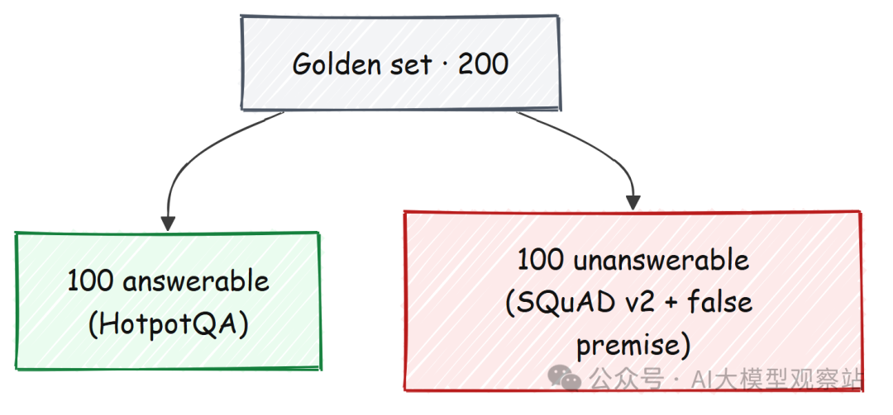

```
def build_false_premise_set() -> list[EvalItem]:
    qs = [
        "In what year did Albert Einstein win his second Nobel Prize in Physics?",
        "What was the name of the spaceship Marie Curie flew to the Moon?",
        "How many gold medals did William Shakespeare win at the Olympics?",
        "Which programming language did Isaac Newton invent in 1700?",
    ]
    return [EvalItem(f"fp_{i}", q, "", [], False, "false_premise") for i, q in enumerate(qs)]
```

```
#### OUTPUT ####
[golden] 200 items  (answerable=100, unanswerable=100)
```

最终得到一个平衡的 **200 question** set，一半 answerable，一半不可答。false-premise questions 刻意荒谬，比如问 Newton 在 1700 年发明了哪种语言，因为一个会回答这些问题的系统，也会为任何听起来自信的问题编造 facts。

平衡两半很重要，因为如果 set 主要是 answerable，一个系统即使在 hard cases 上 bluff，也可能得分不错。这个 set 的一半存在的唯一目的，就是衡量克制。

### 幻觉存在于一个单元格中

现在我们在全部 200 个问题上运行 agent，并把结果打成一个 two-by-two table。行是 answerable 或 unanswerable，列是 answered 或 abstained，而唯一危险的单元格是 unanswerable 且 answered，因为根据定义这就是 hallucination。

```
def confusion_2x2(results, items) -> np.ndarray:
    cm = np.zeros((2, 2), dtype=int)   # rows: answerable/unanswerable, cols: answered/abstained
    for r, it in zip(results, items):
        i = 0 if it.answerable else 1
        j = 0 if r.final.status == "answered" else 1
        cm[i, j] += 1
    return cm
```

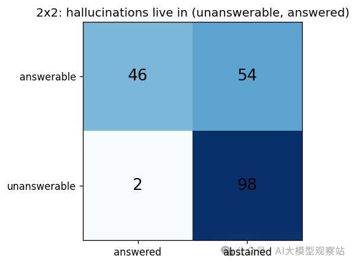

```
#### OUTPUT ####
confusion (rows ans/unans, cols answered/abstained):
 [[46 54]
 [ 2 98]]
hallucinations (unanswerable answered): 2 / 100 unanswerable
```

看 bottom row，因为这就是全部重点。在 100 个 unanswerable questions 中，系统对 **98** 个 abstained，只回答了 **2** 个，也就是在专门用来诱捕它的问题上 **2 percent** 的 hallucination rate。

没有 verification gate 的普通 RAG 系统会点亮那个单元格，因为没有任何东西阻止它回答一个 corpus 无法支持的问题。matrix 的 top row 是这种安全性的代价，接下来我们看它。

### 安全性的代价

two-by-two 使用了一个固定 threshold，但 threshold 是一个旋钮。调高它，系统会更多 abstain，从而降低 hallucination，但也降低 coverage。为了有意识地选择它，我们 sweep threshold 并画出 risk-coverage curve，然后选择一个在 hallucination 保持低于预算的同时尽可能多回答的点。

```
def pick_tau(df, max_halluc: float = 0.05) -> float:
    # among thresholds that keep hallucination under the budget, take the most coverage
    ok = df[df["hallucination_rate"] <= max_halluc]
    return float(ok.sort_values("coverage", ascending=False).iloc[0]["tau"]) if len(ok) else 1.0
```

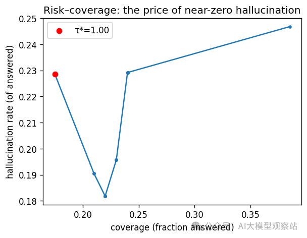

```
#### OUTPUT ####
chosen τ* (halluc<=5%): 1.0
metrics: {
  "faithfulness": 0.908,
  "answer_relevancy": 0.817,
  "context_recall@k": 0.97,
  "answerable_accuracy": 0.58
}
```

在 answered questions 上，我们得到 **0.908 faithfulness** 和 **0.97 context recall**，这说明证据在那里，答案也保持 grounded。代价是 matrix 的 top row。

100 个 answerable questions 中，我们回答 **46** 个，其余 abstain，coverage 为 0.46。这是有意的 trade-off。

我们宁愿在一个本可以回答的问题上保持沉默，也不愿冒险给出自信但错误的答案。你在这条曲线上的位置是产品决策，而不是模型决策，可以根据 wrong answer 在对应领域中的代价按 corpus 设置。

### Judge 够好吗？

还有一个漏洞需要补上。整个 gate 都依赖 verifier，所以一个未经验证的 verifier 只是把 hallucination 从 answer 转移到了 scorecard。我们单独在 HaluBench 上测试 verifier，这是一个由人工标注 faithful 和 hallucinated answers 的集合，并报告 ROC curve 下的面积。

```
def eval_verifier(verifier, n: int = 300) -> dict:
    hb = load_halubench().shuffle(seed=SEED).select(range(n))
    scores, labels = [], []
    for ex in hb:
        scores.append(verifier.nli_score(ex["answer"], ex["passage"]))  # the judge's support score
        labels.append(1 if str(ex["label"]).upper().startswith("PASS") else 0)
    from sklearn.metrics import roc_auc_score
    return {"auroc": round(float(roc_auc_score(labels, scores)), 3), "n": len(labels)}
```

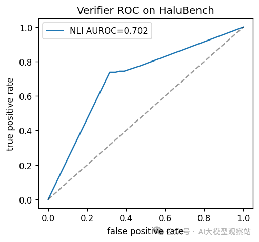

```
#### OUTPUT ####
[verifier] AUROC=0.702 over n=300 HaluBench items
```

verifier 在 300 个 items 上拿到 **AUROC 0.702**，明显好于随机，但远非完美。我想直说这一点，因为它是整个 gate 真正的上限。

更强的 verifier 是能进一步提升上述数字的单一改变，而 architecture 的构建方式允许我们不动其他部分就替换进去。gate 不需要完美 verifier 才有用，它需要的是足够经常地把 supported claims 排在 unsupported claims 之上，以移动 operating point，而 0.702 达到了这个门槛，同时仍有大量提升空间。

## 扩展到 1000 万+ Vectors

### 一个真实的 1000 万 vector index

quality pipeline 已在 curated slice 上证明。现在必须字面证明 scale claim，因为标题说的是 1000 万+ documents，而 benchmark 是唯一能定论的东西。

所以我们在 100k、1M 和 10M vectors 上构建 LanceDB index，带真实 approximate nearest neighbor index，并测量每一步的 build time、on-disk size 和 query latency。我必须使用 approximate IVF\_PQ index，而不是 exact search，因为 exact scan 会把 query 与每个 vector 比较，复杂度随 n 线性增长，这正是 10M 时会爆炸的成本；而 approximate index 只访问少量 partitions，并把每个 vector quantize 到几个 bytes，用一点 recall 换取随着 corpus 增长几乎不动的 latency。

为了保持这是一个干净的 vector-search benchmark，这里的 vectors 是 synthetic 的 1024-dimensional unit vectors，我们通过 Arrow ingest 它们，让路径可以承载数千万行。主机有 180 GB RAM 和 750 GB NVMe disk，所以一个一千万 vector index 可以舒适地放在单机上，而这正是 on-disk store 的全部意义。

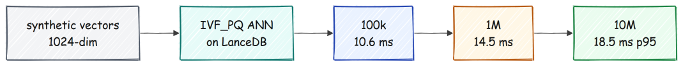

```
class ScaleBench:
    def run(self, sizes: list[int]) -> "pd.DataFrame":
        rows = []
        for n in sizes:
            vecs = make_synthetic_vectors(n, self.dim)         # 1024-dim unit vectors
            db = lancedb.connect(str(SCRATCH_DIR / f"scale_{n}"))
            t0 = time.time()
            tbl = db.create_table("v", data=self._arrow(vecs), mode="overwrite")
            if n >= 100_000:                                   # build a real ANN index
                tbl.create_index(metric="cosine",
                                 num_partitions=int(min(4096, max(256, n ** 0.5))),
                                 num_sub_vectors=64)
            build_s = time.time() - t0
            # then time 50 queries for p50/p95 and check recall@10 against brute force
            rows.append(self._measure(tbl, vecs, build_s))
        return pd.DataFrame(rows)
```

```
#### OUTPUT ####
[scale] building n=100,000 with IVF_PQ ANN index ...
  -> {'n': 100000, 'build_s': 41.82, 'disk_gb': 0.39, 'p50_ms': 8.5, 'p95_ms': 10.59, 'recall@10': 0.135}
[scale] building n=1,000,000 with IVF_PQ ANN index ...
  -> {'n': 1000000, 'build_s': 81.22, 'disk_gb': 3.884, 'p50_ms': 11.34, 'p95_ms': 14.46, 'recall@10': 0.105}
[scale] building n=10,000,000 with IVF_PQ ANN index ...
  -> {'n': 10000000, 'build_s': 347.04, 'disk_gb': 38.825, 'p50_ms': 16.91, 'p95_ms': 18.48, 'recall@10': 0.105}
```

headline 在最后一行。一个 **10M-vector** index 以 **18.48 ms p95** 回答，而小 100 倍的 index 回答时间为 10.59 ms。

数据增长一百倍，latency 增长不到一倍。disk 线性增长，从 0.39 GB 到 38.8 GB，这正是我们想要的，因为 disk 便宜，而这种规模的 in-memory index 并不合适。

Build time 也以同样温和的方式增长，从十万 vectors 的 42 秒到一千万的不到 6 分钟，并且每一个 byte 都留在单机 NVMe disk 上。

### 1000 万时 18 ms，以及 1 亿的外推

latency 几乎不动的原因是 approximate index 的性质。IVF\_PQ index 搜索少量 partitions，而不是整个 space，所以 query cost 随 partitions 数增长，而不是随 vectors 数增长；同时 disk 线性增长，因为每个 vector 仍然必须存储。我们拟合这一趋势，并外推到 100M。

```
def fit_and_extrapolate(df, target: int = 100_000_000) -> dict:
    n = df["n"].values.astype(float)
    out = {"target": target}
    for col in ["build_s", "disk_gb", "p95_ms"]:
        a, b = np.polyfit(n, df[col].values, 1)     # linear fit in n
        out[col] = round(float(a * target + b), 2)
    return out
```

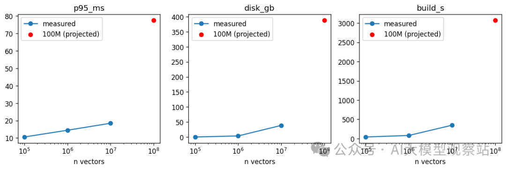

```
#### OUTPUT ####
projection to 100M: {
  "build_s": 3075.1,
  "disk_gb": 388.23,
  "p95_ms": 77.58
}
```

在 **100M vectors** 时，projection 落在 **77.58 ms p95**，index 为 388 GB，仍能放在单台机器的 NVMe disk 上。这里要明确一个 caveat。

这里 recall at 10 接近 0.1，只是因为 vectors 是 random 的，这让 approximate index 几乎没有真正可找的东西，所以这次 run 衡量的是 latency 和 throughput，不是 retrieval quality。在真实 corpus 上，同一个 index 会保持高 recall，而 latency numbers 才是 scale 时保持成立的部分。

### 时间花在哪里

Scale 是容易的部分。昂贵的是 per-query agent，所以我们按阶段归因 latency，看看预算实际花在哪里。

```
def aggregate_latencies(results) -> "pd.DataFrame":
    stages = {}
    for r in results:
        for k, v in r.latencies.items():
            stages.setdefault(k, []).append(v)
    rows = [{"stage": k, "p50_s": round(np.percentile(v, 50), 3),
             "p95_s": round(np.percentile(v, 95), 3),
             "mean_s": round(np.mean(v), 3)} for k, v in stages.items()]
    return pd.DataFrame(rows).sort_values("mean_s", ascending=False)
```

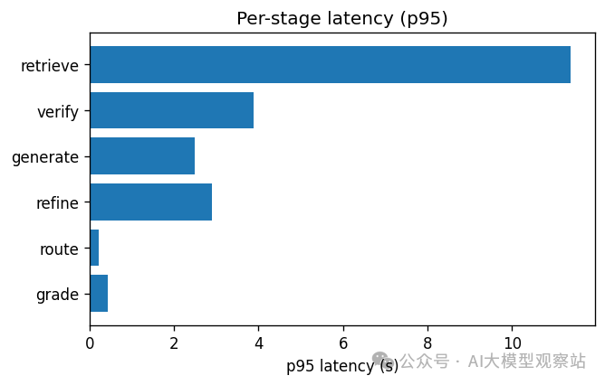

```
#### OUTPUT ####
   stage  p50_s  p95_s  mean_s
   total  4.001 17.668   5.823
retrieve  3.074 11.393   4.166
  verify  1.534  3.878   1.758
generate  1.451  2.484   1.619
  refine  1.471  2.888   1.575
   route  0.168  0.206   0.170
   grade  0.127  0.431   0.161
```

典型问题在 median 约 **4 秒** 完成，慢尾在 p95 达到 17.7 秒。**Retrieve dominates**，因为它运行 embedder、两种 searches，并让 cross-encoder reranker 处理 150 个候选；在困难问题上，它还会通过 corrective loop 运行不止一次。

vector search 本身是便宜的部分，这也是 scale lab 教给我们的同一个结论。index 不是 bottleneck，围绕它的 language model calls 才是。

这在优化前值得知道，因为它意味着收益来自减少 model calls、batch reranker 或 caching grades，而不是换一个更快的 vector store。

## 范围和下一步

最后我想明确说明这是什么，以及它不是什么。hallucination rate 是 **unanswerable set 上 2 percent，不是零**，因为从 generative model 出发不可能实现字面上的零。

answerable questions 上的 coverage 是 **0.46**，这是我们为这种安全性有意付出的代价，而 risk-coverage curve 是在两者之间 trade 的旋钮。10M run 是基于 synthetic vectors 的 vector-search benchmark，所以它证明 index 在 latency 和 disk 上可以 scale，而真实 corpus 才是在同等速度下保持高 recall 的东西。

verifier 的 **AUROC 为 0.702**，不错但不算优秀，它是下一步最值得改进的部分。

从这里开始，有几个方向值得投入。

1. **更强的 verifier**：gate 的质量取决于 judge，所以更好的 faithfulness model 会一次性提升所有 downstream numbers。
2. **真实 embeddings 的规模化**：在真实 document vectors 上重新运行 scale lab，确认 recall 保持的同时 18 ms latency 仍然成立。
3. **Sharding 和 quantization**：超过单机后，index 会拆分到 shards 上，而上面的 correctness logic 完全不变。
4. **校准 coverage**：按领域调整 thresholds，让 high-stakes corpora 更多 abstain，casual corpora 更多 answer。

这些下一步都不会改变设计主干。index 可以增长，verifier 可以改进，thresholds 可以移动，但 contract 保持不变。到达用户的每个句子，都是系统能够在 retrieved text 中指向的句子，其余全部变成 abstention。

整件事就是一个想法贯彻到底。我们不试图让模型永远不出错，而是构建一个系统，只说它能证明的内容，否则就拒答。index 以 18 ms 扩展到一千万 vectors，answers 以 0.908 faithfulness 保持 grounded，而它无法支持的问题会返回一句直白的“I do not have enough evidence”，而不是自信的猜测。

包含每个 code cell 和真实 run outputs 的完整 notebook 在 GitHub 上：

https://github.com/FareedKhan-dev/rag-zero-hallucinations
