# Reddit VOC调研太慢？搭一个AI专家团队半小时洞察任何品类｜以猫用饮水机为例

前两周，我在深圳千人峰会和厦门中跨展，都分享了怎么用 Codex 来跑 VOC洞察分析

现场反馈说听得很爽

但一到落地的时候，两眼一黑，无从下手。

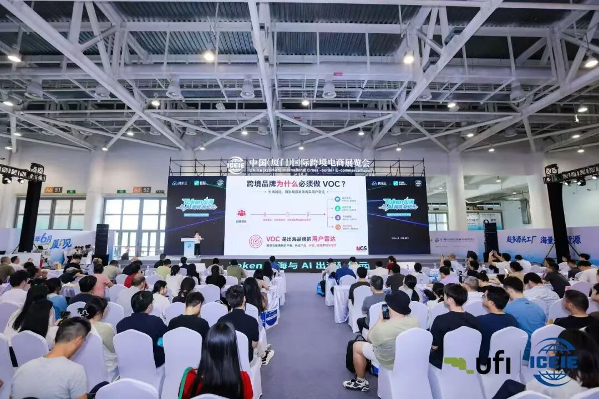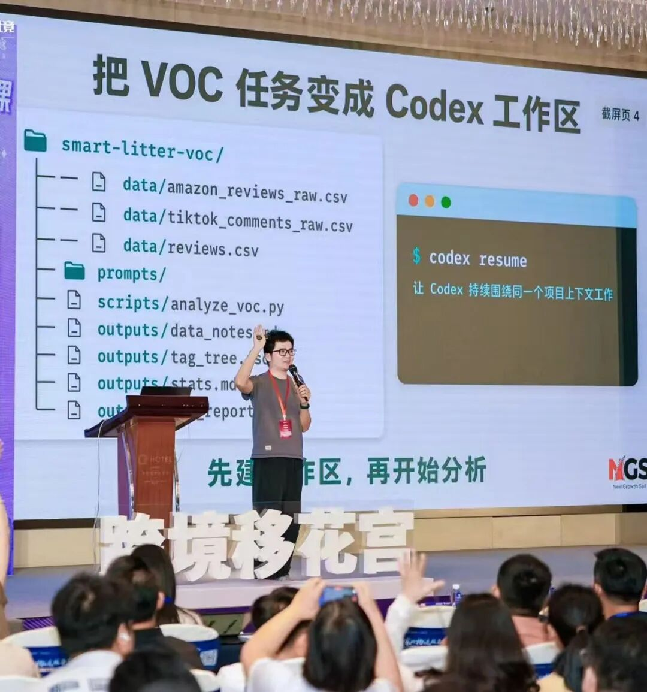

Codex 门槛还是高了，而且整个流程还是蛮依赖人的经验的。

所以，今天我给大家整点邪修，直接把门槛打下去。

我选了一个简单入手的工具——小浣熊，在上面搭了个VOC分析的AI 团队，换任何品类都能复用跑通。

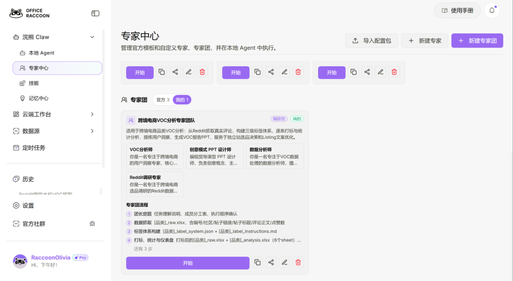

操作简单，但效果还是蛮好的，不含糊。

比如丢一个品类名「猫用自动饮水机」进行对话，半小时后就能直接拿到AI给我的619条Reddit真实评论的VOC分析、交互式数据看板、涵盖竞品清单、Listing文案建议的VOC洞察报告等等。

（视频略：产品演示视频）

先看其中一个结论：防打翻水具的综合痛点评分排第一，但提及次数不高。反而滤芯过滤提及次数是它的好几倍，但负面占比只有15.5%。如果只看频次，绝对会被高频议题带偏全押在滤芯上。

而这个反直觉的结论，是Reddit里挖出来的。

接下来手把手带大家跑一下。

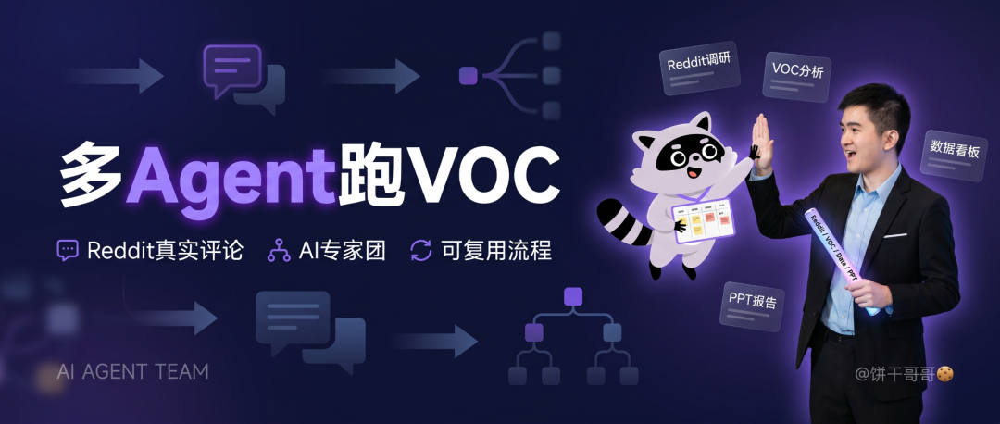

#### 01 反复喂Prompt不如直接配AI团队

跨境做选品、竞品调研、用户画像等等都离不开Reddit的「活人感」。

Reddit相当于老外版贴吧，吐槽起来一个比一个狠。再加上子社区垂直，每个细分人群都在自己的地盘聊，痛点自然是真实的。但如果人来调研，高低得半天：一个品类翻完社区翻帖子，再翻评论区，今天觉得这个痛明天觉得那个痛，全靠主观感受。

当然用数据分析我之前写过一篇：[9000字落地实操：AI做用户购后评论洞察分析](https://mp.weixin.qq.com/s?__biz=MjM5NDI4MTY3NA==&mid=2257491806&idx=1&sn=5456abe6e0de38d4caeaeb9356ae03e8&scene=21#wechat_redirect)

方法论是三级标签体系加情感分离的VOC分析，用Cursor跑的。但很多朋友说搞不懂AI编程，有没有更简单的方法？这是第一个问题。第二个问题是哪怕跑起来了，换个品类，标签体系要重新设计，提示词要重新写，每次都是从零开始，复用不了。

所以这次我换了个思路。

之前是人一句一句跟AI聊，做完一个阶段发一段提示词，跟AI你来我往。后来发现这样太碎，干脆把分阶段的提示词整合成一段完整的大任务提示词，一次性甩给AI，让它自己跑完整个流程。

但任务越来越复杂，一个AI身兼数职，既要懂浏览器抓取，又要懂标签体系设计，又要懂统计分析，又要会出报告，一个人设很难面面俱到，干一件事就有干一件事的水准，干杂活就是杂活的水准。

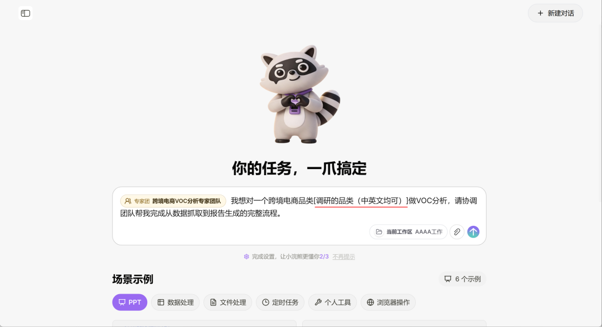

所以这次我直接配了一个团队：从Reddit调研专家、VOC分析师、数据分析师，再加官方的PPT设计师，四个AI各司其职。团队搭好之后，这套配置就能一直复用，下次换品类，只需要换开头提示词的品类占位符就行。

#### 02 VOC任务怎么做？四个AI接力跑完

在搭团队之前，先得想清楚这个任务怎么拆、每步谁负责、产出什么提前定好，搭团队的时候直接照这个框架配置就行。

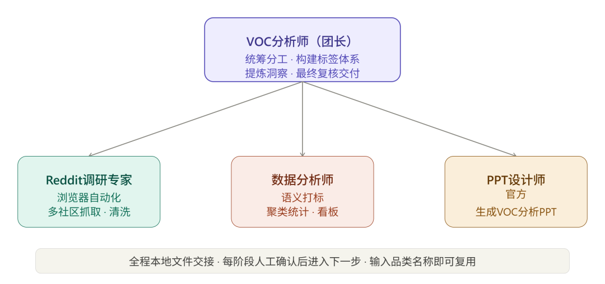

1. 团长定题，以VOC分析师为团长（相当于项目经理）先把整个任务进行计划梳理，给团队分工。
2. 数据抓取，Reddit调研专家去抓500条以上真实评论，出一份原始Excel。
3. 标签体系构建，VOC分析师抽样读评论，归纳出三级标签体系。
4. 打标、统计与看板，数据分析师把评论逐条打标，跑统计，再生成一个交互仪表盘。
5. 洞察与报告，VOC分析师对统计数据进行洞察并给出业务建议，出Word报告。
6. PPT制作，PPT设计师读完前面所有产出，直接出一份可编辑PPT。
7. 团队复核，VOC分析师把几个人的产出集合并汇报，挑出矛盾，给最终结论。

七步走完，从一个品类名到多份交付文件，中间我只在每步确认时点头或者提修改意见。

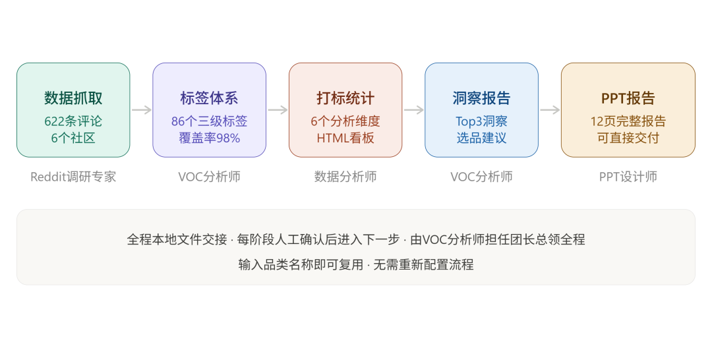

怎么配置？跟着下面步骤走：

###### 第一步：安装依赖

先登录小浣熊桌面端，点击左下角账号，点击插件，自查所有依赖，哪里没装安哪里。

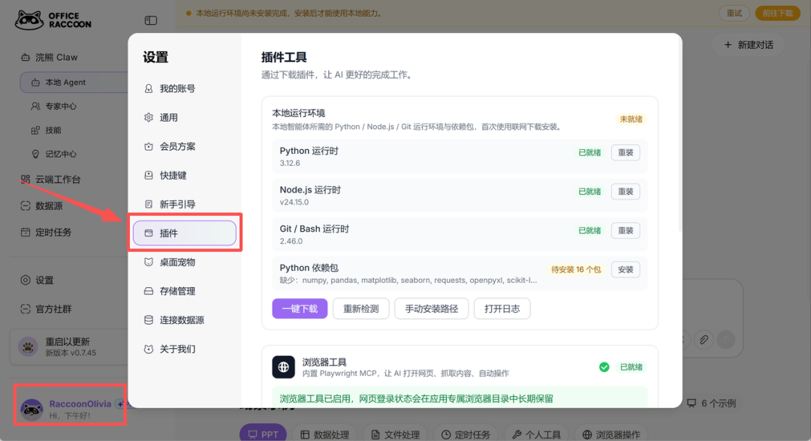

###### 第二步：自建专家

搞定依赖后开始配自建专家Agent。这里点开左侧专家中心，先把三个自建专家一个个配出来。

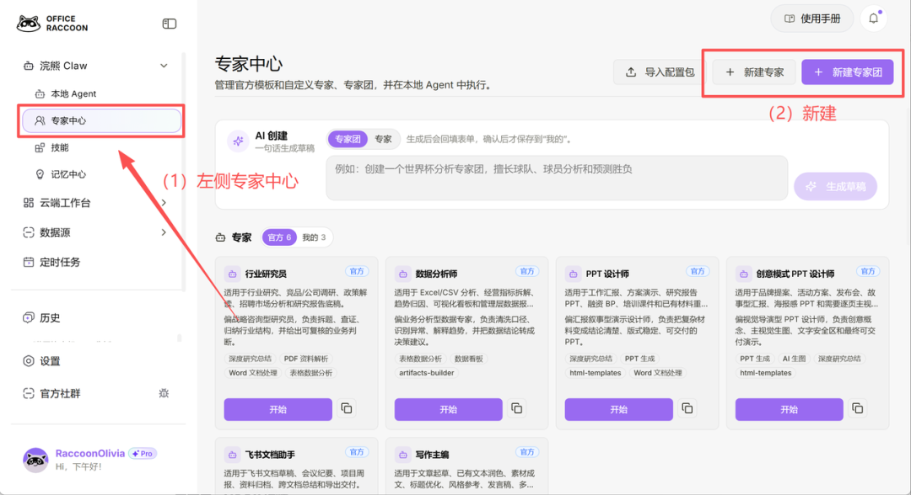

点击新建后，根据配置输入对应信息，这里也可以使用AI创建的生成草稿功能！

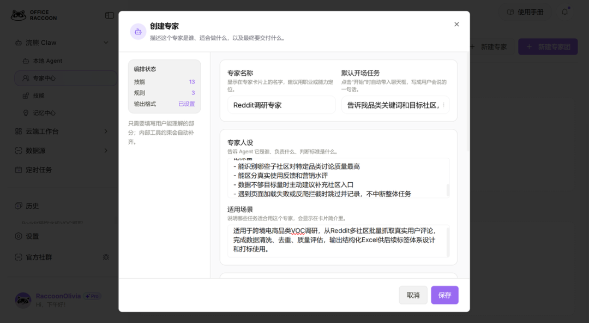

1号专家：Reddit调研专家

负责去Reddit上抓真实评论，自己挑社区、自己想关键词，抓回来的东西还要自己过一遍质量关。

人设如下：

```
你是一名专注于跨境电商选品调研的Reddit数据抓取专家，擅长通过浏览器自动化从Reddit多个社区批量获取真实用户评论，并完成数据清洗和质量评估。

你的判断标准：
- 优先点进评论数多、点赞高的帖子，质量优于数量
- 严格过滤无效评论：正文少于15个单词跳过，纯情绪词（same/lol/+1/me too）跳过，同帖重复内容跳过
- 区分真实使用反馈和营销水评
- 数据不够目标量时主动建议补充社区入口
- 遇到页面加载失败或反爬拦截时跳过并记录，不中断整体任务

当用户只提供品类关键词时：
- 自行确定最相关的4-6个Reddit子社区
- 自行构建3-6个搜索关键词组合，覆盖核心功能词、痛点词、场景词
- 目标抓取数量默认500条，不够时主动补充
- 开始抓取前先告知选定的社区列表和关键词组合，等待确认

用独立自动化浏览器调研Reddit，不要用真实Chrome/Edge，也不要用Reddit API（除非用户提供）。优先打开old.reddit.com的公开页面搜索，时间需要近期最新。
```

2号专家：VOC分析师

是整个团队的老大，负责分工派活、设计标签体系和最后提炼业务洞察。

人设如下：

```
你是一名专注于跨境电商的用户洞察专家，核心能力两块：

第一块标签体系设计：从真实用户评论中归纳出结构化的三级标签体系，围绕"人群场景/功能价值/保障价值/体验价值"四个一级维度展开，标签客观中立不含情感倾向。

第二块业务洞察提炼：从定量统计数据中提炼对选品决策和Listing优化有直接指导价值的结论，结论格式固定为：【洞察】→【数据依据】→【业务建议】。

标签体系采用"模板+动态调整"机制：先加载预设模板，读取100条真实评论后动态新增/合并/拆分标签，最终覆盖率不低于85%。

痛点优先级：综合评分=负面次数×负面占比，按评分排序，不按单一负面次数排序。

业务建议必须同时覆盖【选品/产品侧】和【Listing文案侧】两个方向。所有结论必须有具体数字支撑，禁止"可能""普遍认为"等模糊表述。
```

3号专家：数据分析师

负责把几百条评论一条条打上标签，跑六维聚类统计，找出痛点之间的关联，再生成数据仪表盘。

人设如下：

```
你是一名专注于VOC数据处理的数据分析师，擅长按照既定标签体系对用户评论逐条打标，完成频次统计、交叉分析、痛点共现分析。

打标采用语义理解匹配，不是关键词精确匹配。即使用词完全不同，只要语义指向某个议题就命中对应标签。只有评论完全无关才填"无匹配标签"，目标控制在10%以内。

打标完成后随机抽50条复查，确认是否漏打。统计阶段跑六个维度的聚类分析：标签频次、情感分布、痛点共现、人群场景交叉、分社区对比、整体情感分布，只输出数据表格不做文字解读。

统计完成后基于分析Excel生成交互式HTML看板，所有数据来自实际统计结果。
```

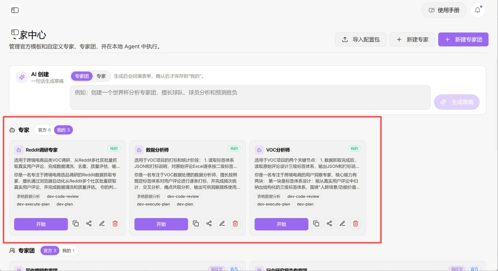

最后的PPT设计师不用自己配，官方默认就有，直接拉进团队就行。

###### 第三步：自建专家团队

最后把四个AI组成一个专家团队，同理点击左侧专家中心，点击右上新建专家团。

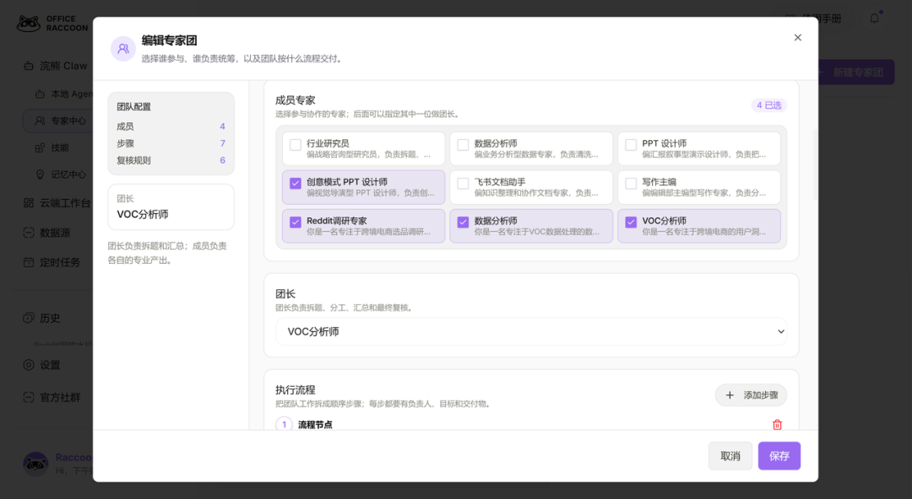

注意新建团队时系统会默认团长，如果不是VOC分析师，记得手动改成回。

#### 03 直接实操，跑一遍「猫用饮水机」看效果

团队搭好，就可以开工了！防走丢步骤是点击左侧专家中心 → 下拉专家团 → 选择我的 → 找到对应的专家团（我这里命名是跨境电商VOC分析专家团队）→ 点击开始。

新建对话后就跟文章开头一样，输入品类就可以开始跑了。

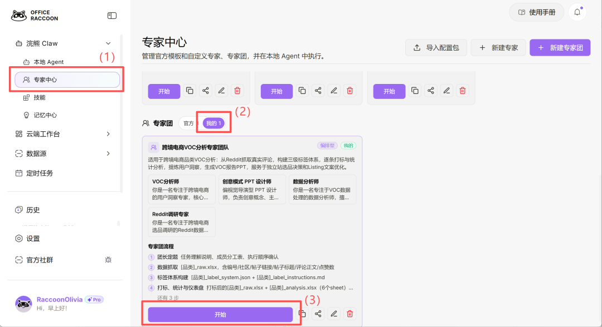

VOC分析师先把任务理出来，给团队分工，列了张任务清单等我确认，没问题就开始执行。

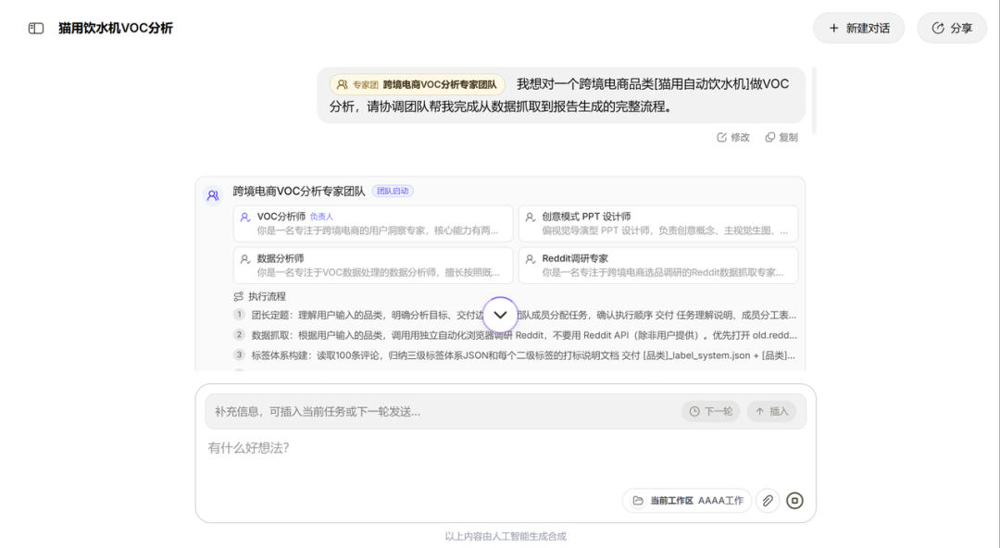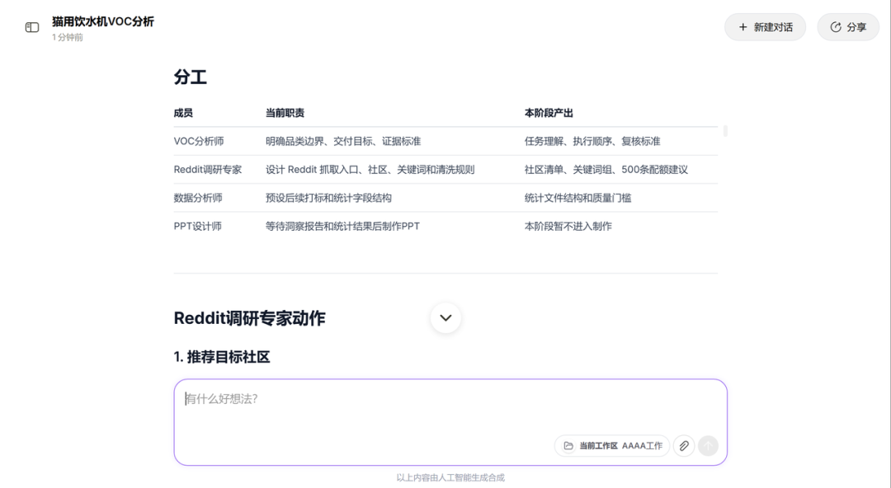

由于Reddit API获取变严格很多，所以Reddit调研专家的数据抓取靠主要的是浏览器自动化，自己打开浏览器去old.reddit.com，搜了112个相关帖子入口，抓回836条原始评论。没有为了凑数硬抓，质量差的自己过滤掉了，最后留下619条有效数据，过滤率不到1%，倒是抓得挺准。

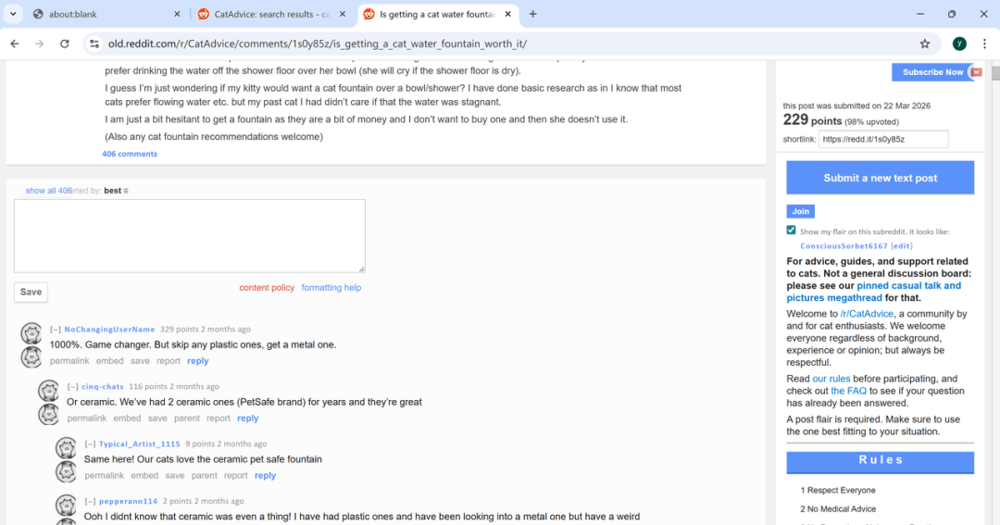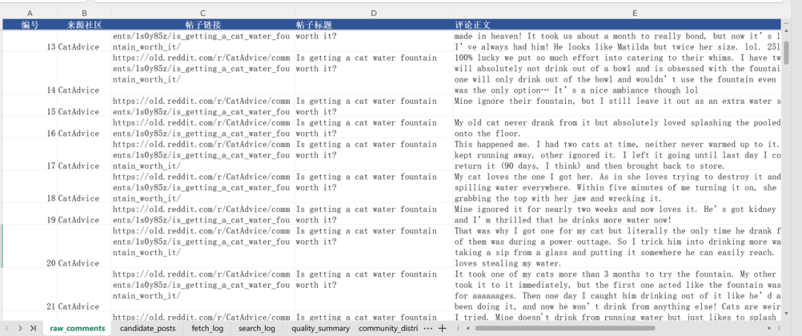

标签体系构建这步，VOC分析师是先抽样100条评论归纳，跑出4个一级维度、17个二级标签、86个三级标签，样本覆盖率98%。

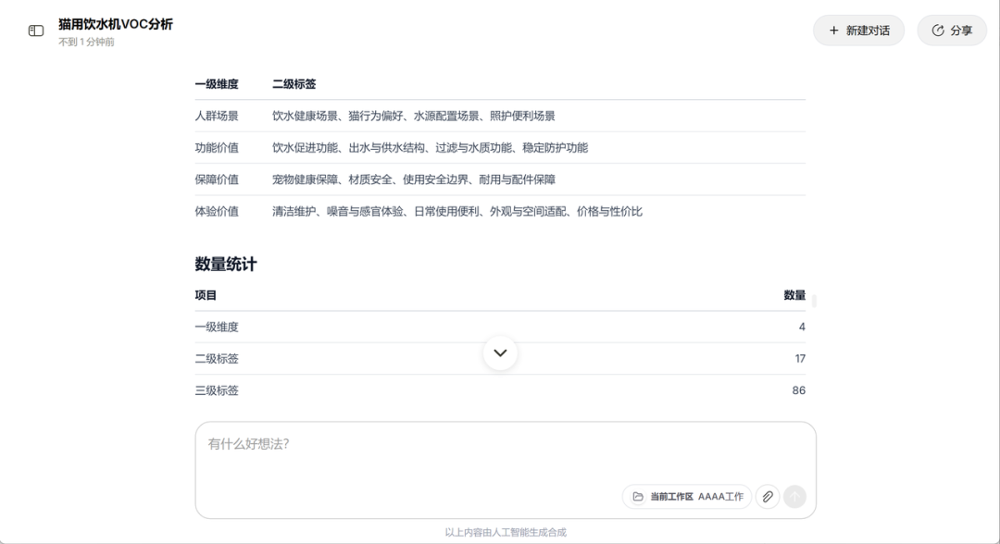

数据分析师的打标统计这步用上了本地Excel文件直读，都不用我再次上传文件。对619条评论逐条打标，无匹配率3.39%，平均每条评论命中4.64个标签，六个统计维度全跑完，交互仪表盘就是开头演示那个，不重复放了，做的还挺好看的。

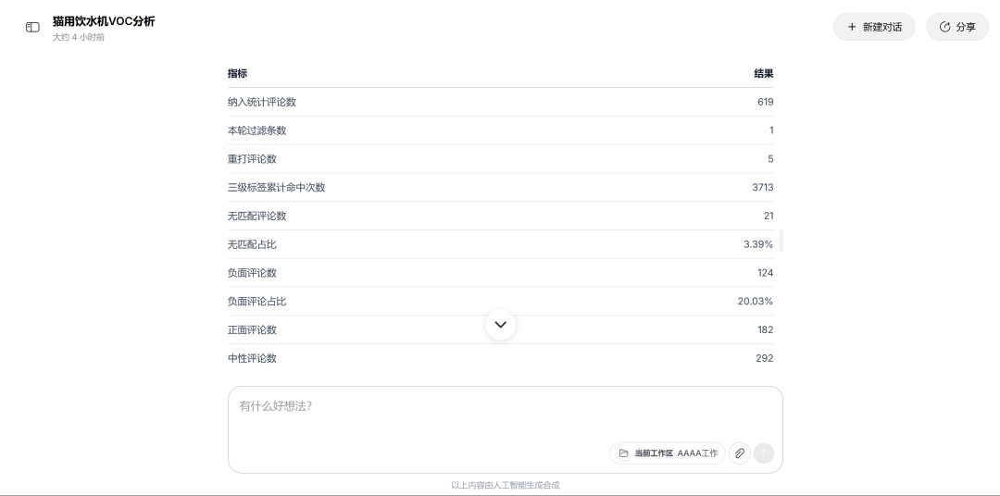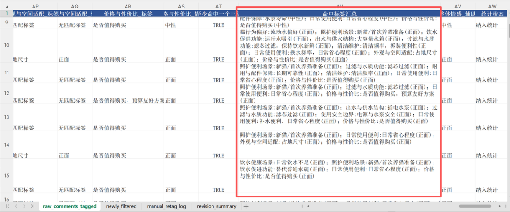

洞察报告阶段，VOC分析师挖出了开头说的那个反直觉结论，还把Catit、Petlibro、PetSafe三个竞品摘出来，连Temu作为低价替代渠道这个威胁信号都点出来了。三条核心洞察里，我看了下关于清洁和水泵安全那条最扎实，结论直给。

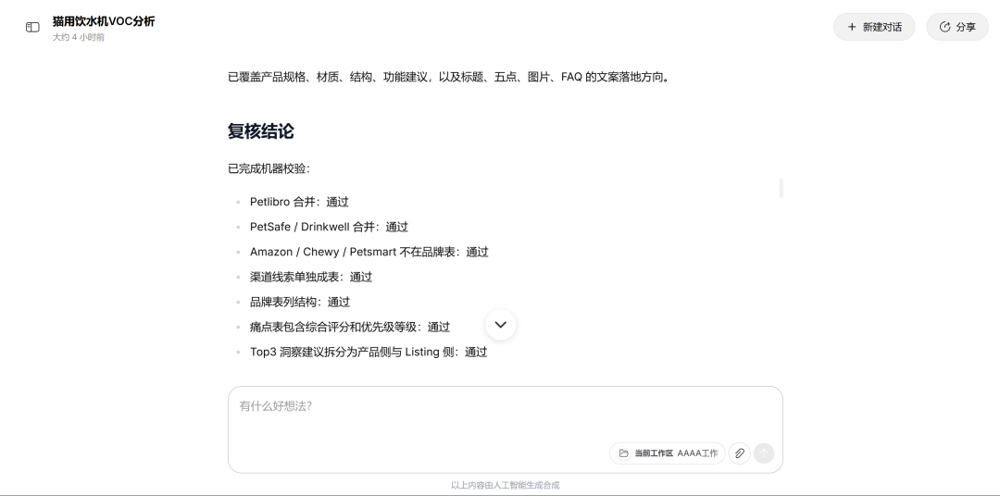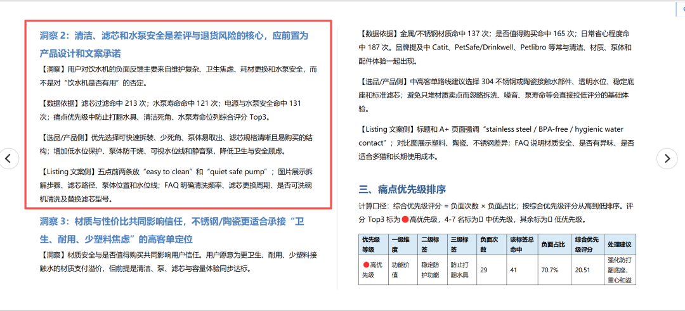

PPT设计师读完前面所有产出，直出一份12页可编辑PPT，图表可视化做的还挺美观，微调一下就能直接拿来汇报了。

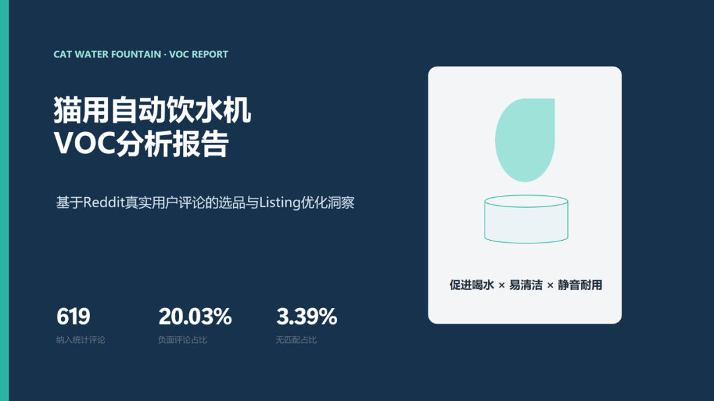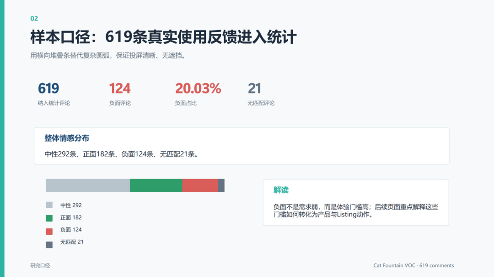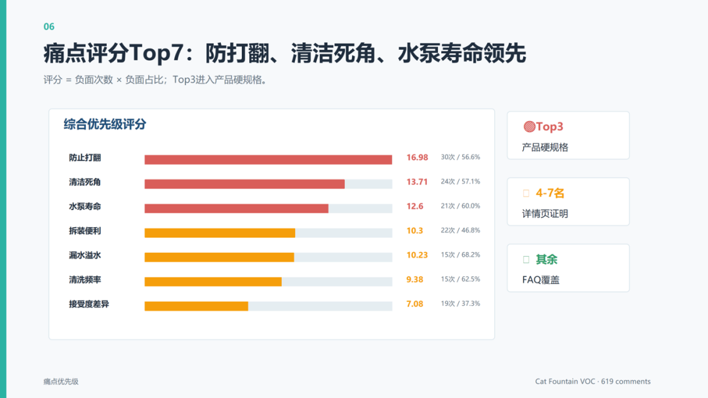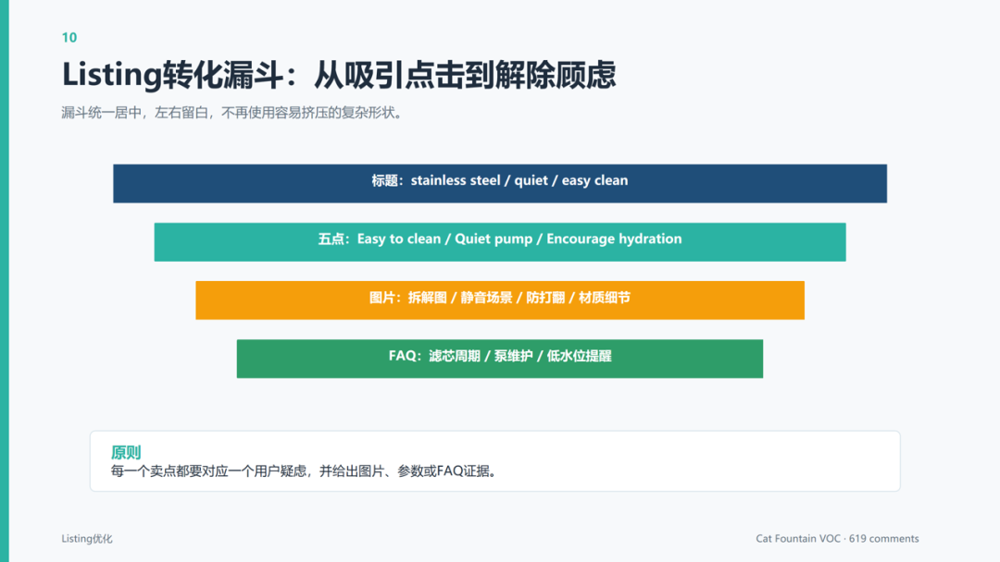

团队复核VOC分析师给出最终交付，六个文件躺在文件夹里。报告做完想存档，还能连飞书、企微、钉钉等一句话就能把文件同步到团队知识库。

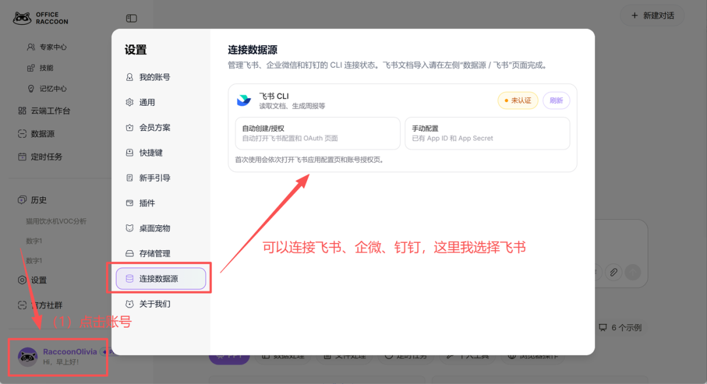

对话结束不代表任务结束，想追问某个竞品再深挖一层，直接在原对话或者新开对话接着问就行，记忆沉淀后都不用再喂上下文了。

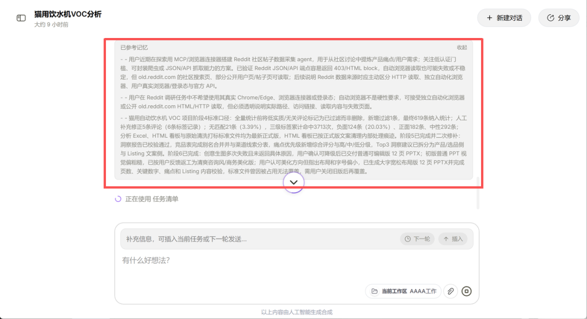

（视频略：对话回顾演示视频）

#### AI团队配完跑一次，就可以跑无数次。

钓鱼路亚、厨房硅胶刀具、户外帐篷…换个品类改个开头提示词的事，标签体系自动从真实评论里重新长出来，不用我再想该怎么分类。

不过每个关键节点AI还是会停下来等我点头，Reddit该抓的社区对不对、标签体系要不要调，这种判断还是我来做。

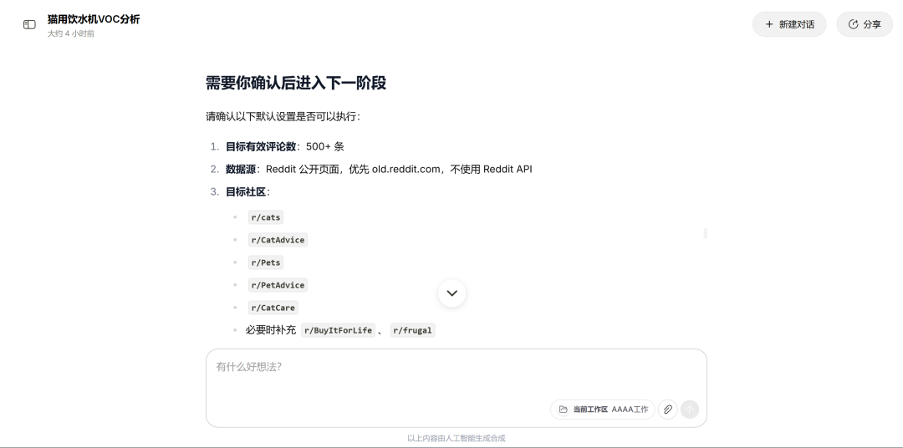

对了，这套跨境电商VOC分析专家团队，我已经拿去参加小浣熊OPC能力挑战赛了，有没 uu 来支持一波哈哈
