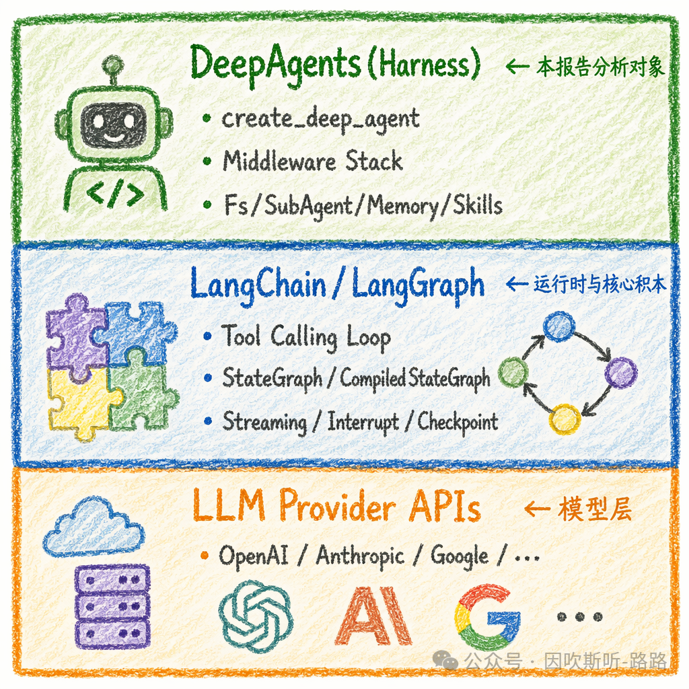
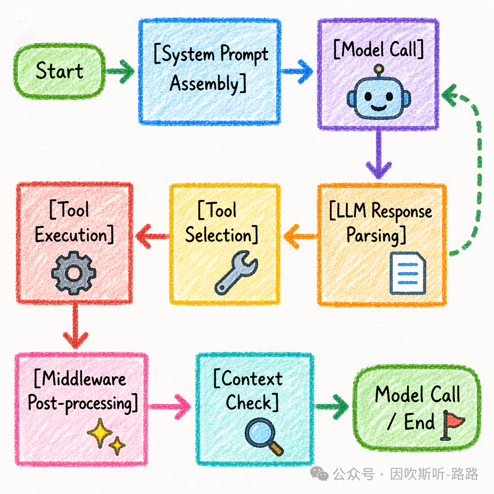
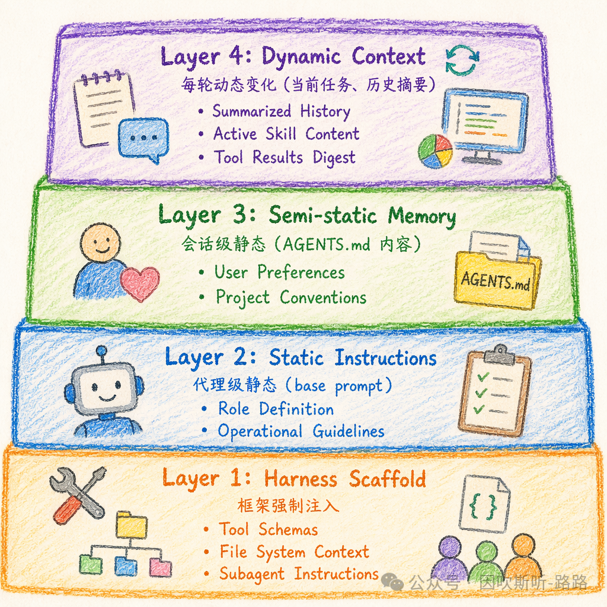
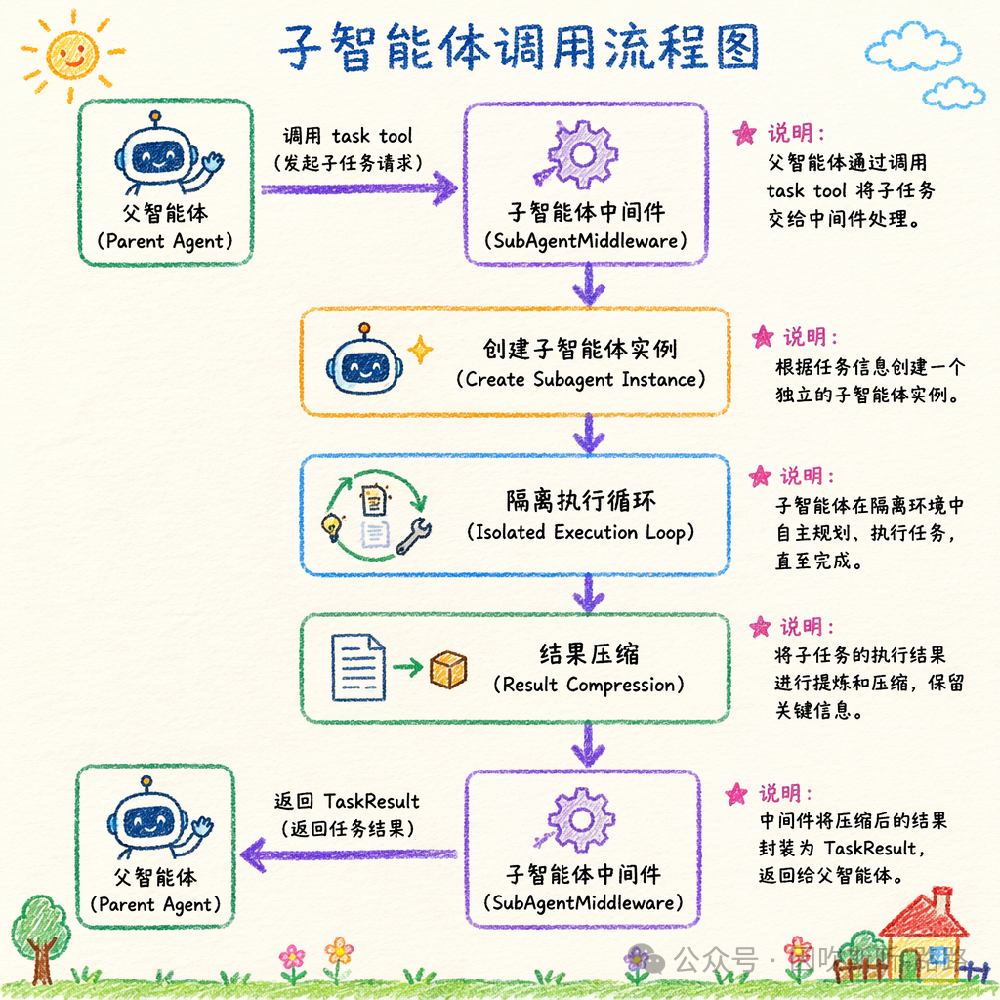

# DeepAgents 深度源码解析与全框架工程实践

> LangChain 团队于 2025-2026 年推出的生产级 Agent Harness 框架，构建于 LangGraph 运行时之上。本文从源码实现、设计原理、工程实践三个维度，对 DeepAgents 进行全框架、全组件的深度解析。

## 第一章：概述与架构总览

### 1.1 项目定位

DeepAgents 被明确定义为一个 **"batteries-included agent harness"**——带有强烈主观意见但保持可扩展的智能体控制框架。四大设计原则：

1. **Opinionated Defaults** — 针对长周期、多步骤复杂任务默认调优
2. **Extensibility Without Forking** — 任何组件均可通过中间件/配置/钩子覆盖
3. **Model Agnostic** — 兼容所有支持 tool calling 的模型（frontier → 本地模型）
4. **Production Ready** — 构建于 LangGraph，原生支持流式、持久化、checkpoint、tracing、评估

### 1.2 框架分层

DeepAgents 是 LangChain 技术栈的 **第三层抽象**：

- LangChain → LangGraph → **DeepAgents**
- 源码大量委托 LangGraph 基础能力（状态管理、节点编排、中断），自身聚焦 **Harness 层的能力编排**



### 1.3 核心能力全景

| 维度 | 核心能力 | 对应组件 |
|------|----------|----------|
| 执行环境 | 工具调用、文件读写、代码执行 | Tools, Virtual Fs, Sandbox, Interpreter |
| 数据连接 | 记忆加载、技能注入、领域知识 | Memory, Skills, Backends |
| 上下文管理 | 历史摘要、大结果卸载、缓存 | SummarizationMiddleware, Prompt Caching |
| 并行化 | 任务规划、子代理委派 | write_todos, task tool, SubAgentMiddleware |
| 人在回路 | 关键决策点暂停审批 | HITL via LangGraph Interrupt |
| 持续改进 | 基于使用更新记忆与技能 | Auto-memory update, Feedback loop |

## 第二章：Agent Harness 执行引擎

### 2.1 create_deep_agent：入口函数初始化流水线

五阶段初始化：

1. **模型解析阶段** — 解析 `provider:model` 格式，延迟加载 LangChain ChatModel
2. **后端初始化阶段** — 默认 `StateBackend`（基于 LangGraph Store）
3. **Harness Profile 应用阶段** — 按模型加载对应 Profile（默认工具集、中间件栈、排除项）
4. **中间件栈组装阶段** — 洋葱模型：`[FilesystemMiddleware, SummarizationMiddleware, SubAgentMiddleware, MemoryMiddleware, SkillMiddleware]`
5. **图编译阶段** — 编译为 LangGraph `CompiledStateGraph`

### 2.2 Tool Calling Loop

关键源码设计点：
- **消息格式标准化** — 统一使用 LangChain `BaseMessage` 子类；中间件介入前经 `MessageNormalizer` 格式校验
- **工具 Schema 生成** — 通过 Python 类型注解和 docstring 反射自动生成；支持**复合工具**（一个函数对应多个逻辑工具视角）
- **流式事件模型** — 输出结构化事件流（`AgentEvent`）：`message`, `tool_call`, `tool_result`, `value`, `subagent`



### 2.3 Streaming 架构

`agent.stream()` 返回 **类型化投影（Typed Projection）** 生成器。`EventProjector` 类负责将 LangGraph state updates 映射为高层语义事件。子代理通过 `stream.subagents` 提供独立事件句柄，实现真正的并行可视化。

## 第三章：提示词上下文工程设计

### 3.1 四层模型



- **Layer 1: Base Personality** — 核心身份定义，极少变化
- **Layer 2: Role Instructions** — 专业角色定义，准静态
- **Layer 3: Tool Definitions** — 工具 schema 注入，半动态
- **Layer 4: Context Injection** — 真正动态部分（日期、OS、git 状态、技能列表、记忆摘要）
- **Layer 5: Dynamic Rules** — 项目级指令（AGENTS.md/CLAUDE.md），最灵活

### 3.2 Prompt Caching 策略

DeepAgents 针对 Anthropic/Amazon Bedrock 模型自动应用 prompt caching：
- 在 system prompt 最后一个静态内容块后插入 `cache_control` 标记
- `PromptCachingMiddleware` 官方集成
- 其他模型通过 provider-specific middleware 实现或退化

> QWN 系列（DashScope）的缓存实现示例：通过 `DashScopeContextCacheMiddleware` 在消息末尾附加 `cache_control: {type: "ephemeral"}`。

### 3.3 PromptAssembler

核心类负责：接收各中间件/Profile/用户的 prompt 片段 → 按固定优先级排列 → 处理分隔符设计 → 插入缓存标记 → 执行模板渲染（Jinja2 类似语法，支持条件渲染、循环、变量插值）。

## 第四章：记忆系统

### 4.1 双轨设计

| 类型 | 载体 | 生命周期 | 更新方式 |
|------|------|----------|----------|
| 长期记忆 | AGENTS.md 文件 | 跨会话持久 | 手动 + 自动更新 |
| 短期记忆 | LangGraph State | 单会话 | 运行时追加 |
| 压缩记忆 | .context/summary 文件 | 跨会话 | 自动摘要生成 |

### 4.2 AGENTS.md

遵循 agents.md 规范，支持三种后端：`StateBackend`（内存/持久化）、`StoreBackend`（外部 KV）、`FilesystemBackend`（本地磁盘）。**自动更新**机制：任务完成后通过 `update_memory` 工具分析交互、提取偏好并写入，实现代理的自我改进。

### 4.3 Checkpoint 机制

借助 LangGraph checkpoint 持久化，每次模型调用和工具执行后的状态快照被序列化写入 saver。即使代理中断也可从最后一个 checkpoint 精确恢复。

## 第五章：技能系统（Skills）

### 5.1 Agent Skills 标准

遵循 agentskills.io 标准，每个技能为自包含目录：

```
skills/web_research/
├── SKILL.md          # 技能元数据 + 完整指令
├── templates/        # 模板文件
├── scripts/          # 执行脚本
└── references/       # 参考文档
```

### 5.2 渐进式加载机制

`SkillMiddleware` 启动时仅扫描 frontmatter（元数据），运行时按触发词（`triggers`）匹配后才加载完整内容。避免无关技能的 token 浪费。

### 5.3 技能生态系统

支持组合（多技能同时激活，按优先级合并）、版本（Semantic Versioning）、市场（可通过 Git/pip/registry 分发）。

## 第六章：工具系统与 MCP 集成

### 6.1 Tool Registry

`ToolRegistry` 通过 `inspect.signature` + `typing` + `docstring` 自动生成 JSON Schema。对 Pydantic models、TypedDict、Enum 提供一阶支持。

### 6.2 MCP 支持

DeepAgents 是 LangChain 生态最早完整支持 MCP 的框架之一。通过 `load_mcp_tools()` 将 MCP Server 的工具注入代理，标准化工具发现与调用。

### 6.3 内置工具集

`ls`, `read_file`, `write_file`, `edit_file`, `delete`, `glob`, `grep`, `execute`（Sandbox）, `eval`（QuickJS）, `write_todos`, `task`（子代理委派）。

## 第七章：中间件架构（框架的灵魂）

### 7.1 洋葱模型

所有高级能力均以中间件实现，非硬编码在核心循环：

```
正向：mw1.pre → mw2.pre → mw3.pre → core_loop
逆向：core → mw3.post → mw2.post → mw1.post
```

### 7.2 默认中间件栈

1. **FilesystemMiddleware** — 虚拟文件系统、权限检查、多模态文件识别
2. **SummarizationMiddleware** — 上下文长度监控、自动摘要、历史卸载
3. **SubAgentMiddleware** — 子代理生命周期管理、任务委派
4. **MemoryMiddleware** — AGENTS.md 加载与自动更新
5. **SkillMiddleware** — 技能注册、触发检测与指令注入

### 7.3 FilesystemMiddleware 深度分析

- **工具调用拦截**：解析路径 → 检查 `permissions` 规则（first-match-wins）→ 调用后端 → 记录 telemetry
- **多模态支持**：`read_file` 根据扩展名自动返回 `ImageBlock`/`VideoBlock`/`AudioBlock`/`DocumentBlock`

### 7.4 SubAgentMiddleware 关键设计

- **上下文隔离** — 子代理独立的 message history，不污染父代理
- **后端隔离** — 默认创建隔离的文件系统视图
- **结果压缩** — 子代理完整执行轨迹压缩为单条 `TaskResult`
- **并行执行** — 通过 `asyncio.gather` 实现

### 7.5 自定义中间件

开发者继承 `Middleware` 类，覆盖 `pre_process`/`post_process`，通过 `middleware=[..., AuditLogMiddleware()]` 注入即可。

## 第八章：文件系统与权限控制

### 8.1 策略模式后端

| 后端 | 存储 | 持久化 | 场景 |
|------|------|--------|------|
| StateBackend | LangGraph Store | 可配置 | 默认轻量 |
| FilesystemBackend | 本地磁盘 | 是 | 宿主交互 |
| SandboxBackendV2 | Docker/容器 | 会话级 | 安全代码 |
| CompositeBackend | 混合路由 | 按组件 | 复杂权限 |

### 8.2 权限规则引擎

声明式规则 + 优先级匹配（first-match-wins），仅约束内置文件系统工具，`execute` 需通过 sandbox 后端强制隔离。

### 8.3 代码执行沙箱

- **Sandbox 执行**（`execute`）— 基于 Docker/firecracker 完整 OS 沙箱
- **解释器执行**（`eval`）— 嵌入式 QuickJS 运行时，仅 JS，无文件/网络/shell

## 第九章：委派与子代理

### 9.1 任务规划

`write_todos` 工具将任务状态持久化于 Agent State，`TodoManager` 负责 CRUD，每次状态变更触发 `on_todo_changed` 钩子。

### 9.2 子代理生命周期

Fresh Context → Autonomous Execution → Single Handoff → Stateless



### 9.3 声明式子代理

支持独立的权限、工具集与模型选择，实现最小权限原则（PoLP）。

## 第十章：人类在环（HITL）

深度集成 LangGraph `interrupt` 机制：

```python
interrupt_on={
    "edit_file": True,
    "write_file": {"paths": ["*.py"]},
    "execute": True,
}
```

中断执行流程：LLM 生成调用 → interrupt_before 触发 → 状态持久化 → 人类审批（Approve/Edit/Reject）→ checkpoint 恢复 → 继续。

基于 checkpoint 的 exactly-once、state consistency、resume anytime 保证。

## 第十一章：多模态集成

`read_file` 自动识别多模态扩展名返回对应内容块类型。核心挑战：
- Token 计数需调用模型特定 vision tokenizer
- 大型媒体保留引用（文件路径）而非原始内容
- 多模态摘要依赖模型能力

## 第十二章：Harness Profile

### 12.1 Profile 注册

`ProfileRegistry` 维护 `model_pattern → HarnessProfile` 映射，支持通配符匹配。Profile 包含：excluded_tools、excluded_middleware、max_iterations、summarization_threshold 等。

### 12.2 排除工具与中间件

- `excluded_tools` — 从模型可见列表移除（但中间件仍保留）
- `excluded_middleware` — 从默认栈移除（危险操作）
- `tools` allowlist — 仅暴露子集（如只读代理）

## 第十三章：异步与并发

DeepAgents 提供 `invoke`（同步）与 `ainvoke`（异步）两种 API。异步优势：子代理并行委派、MCP 工具异步 IO、流式非阻塞。每次 `invoke` 创建独立 StateGraph thread，状态互不干扰。

## 第十四章：上下文管理

`SummarizationMiddleware` 在 token 超阈值时：保留最近 2-3 轮 → 早期历史压缩为摘要 → 原始历史卸载到 `.context/` 目录。维护三级 token 预算：模型上下文上限 → Harness 压缩阈值（75%）→ 单次调用预算。

## 第十五章：安全架构

遵循 **"Trust the LLM"** 模型——安全 enforcement 在工具/沙箱层，非期望模型自律。

| 层级 | 机制 |
|------|------|
| 网络 | Docker network policies |
| 文件系统 | 虚拟文件系统 + 权限规则 |
| 进程 | 容器化沙箱（Docker） |
| 代码 | QuickJS（无文件/网络） |
| 操作 | HITL via interrupt_on |
| 审计 | LangSmith tracing |

## 第十六章：自动化评估

原生支持 LangSmith 评估系统。建议评估维度：工具使用准确性、任务完成率、上下文效率（摘要丢失率）、安全性（权限违规）、HITL 干预率、Token 效率。

**Harness Engineering** 方法论：不更换模型，通过优化 harness（system prompt、工具集、中间件配置）提升代理性能。

## 第十七章：集成协议与扩展性

企业级部署建议与配置中心（如 Nacos）集成，支持 30s 刷新。扩展点：

| 扩展点 | 接口 | 用途 |
|--------|------|------|
| 自定义后端 | FilesystemBackend | 专有存储 |
| 自定义中间件 | Middleware | 审计/限流/加密 |
| 自定义工具 | Callable/BaseTool | 业务逻辑封装 |
| 自定义子代理 | DeclarativeSubAgent | 领域专用代理 |
| 自定义 Profile | HarnessProfile | 模型/场景调优 |
| 事件处理器 | AgentEvent 订阅 | 实时监控 |

## 第十八章：推荐工程结构

```
project/
├── agents/           # create_deep_agent 封装 + profiles + subagents
├── skills/           # 技能目录
├── memory/           # AGENTS.md
├── tools/            # 自定义工具
├── permissions/      # 权限规则
├── config/           # 环境配置
├── tests/            # 测试 + 评估数据集
└── Dockerfile        # 沙箱镜像
```

---

## 战略分析

### 与现有工具链的对照

DeepAgents 与用户当前使用的 Hermes Agent 分属**不同抽象层次**：

| 维度 | DeepAgents | Hermes Agent（当前） |
|------|-----------|-------------------|
| 定位 | Agent **Harness** 框架 | AI 助手/Agent 运行时 |
| 架构 | LangGraph 有向图 | 会话式 LLM 循环 |
| 中间件 | 洋葱模型，深度可插拔 | Skill 系统（外挂式） |
| 记忆 | AGENTS.md + StateBackend 双轨 | TencentDB Memory + NexSandglass |
| 技能 | SKILL.md 渐进式加载 | SKILL.md 技能系统（同源标准） |
| 子代理 | async 并行委派 + 上下文隔离 | delegate_task 子代理 |
| HITL | LangGraph Interrupt | 无原生支持 |
| 评估 | LangSmith 原生集成 | 无 |
| 多模态 | Image/Video/Audio Block | 有限 |

### 差距与借鉴点

**DeepAgents 做得更好的：**
1. **中间件架构** — 洋葱模型的设计使所有能力可插拔、可替换，比 Hermes 的 skill 系统更灵活。Hermes 的 skill 是"加载指令"，DeepAgents 的 middleware 是"拦截执行流"
2. **Prompt 工程化** — 四层 System Prompt + Prompt Caching + Progressive Disclosure，将 system prompt 视为架构问题而非文案问题
3. **Harness Profile** — 按模型/场景预设配置（排除工具、排除中间件、阈值控制），实现零代码调优
4. **权限引擎** — first-match-wins 的声明式规则，Hermes 当前无文件系统级权限控制
5. **评估体系** — LangSmith 原生集成，支持批量自动化评估

**Hermes 做得更好的：**
1. **用户交互层** — WeChat/Telegram/Discord 等实时消息通道，DeepAgents 是纯后端框架
2. **轻量部署** — 单进程运行，无需 LangGraph Server
3. **记忆系统复杂性** — 四层记忆体系（L0-L3）+ 场景块 + 人格合成，比 AGENTS.md 更结构化

### 整合可能性

DeepAgents 的以下几项设计**值得直接借鉴到 Hermes**：
1. **Prompt 分层架构** — Hermes 的 system prompt 目前是单块文本，改为四层模型后，可利用 provider 的 prompt caching 降低延迟和成本（与 TencentDB Memory 结合使用效果更佳）
2. **Skill 渐进式加载** — 当前 Hermes skill 是一次性全量加载，参考 DeepAgents 的触发词机制按需加载，可大幅节省启动 token
3. **Harness Profile** — 按模型预设中间件/技能/工具集排除，替代当前硬编码的中间件队列
4. **SubAgent 上下文隔离** — 当前 delegate_task 的隔离还不够严格（继承父代理上下文太多），可引入 `TaskSpec` 模式

### 架构价值评估

DeepAgents 的源码解析价值在于：它揭示了 **Agent Framework 从"demo 框架"演进到"生产级 Harness"** 所需具备的能力维度。这不是一个可以"拿来就用"的框架（它假设你已经运行 LangGraph Platform），而是一个**架构参考**——你不需要移植它的代码，但应该理解它的设计决策并评估哪些适合你的栈。

其中 **中间件洋葱模型** 和 **Prompt 层工程** 是两个最高优先级的吸收点，因为它们直接解决 Hermes 当前面临的两个实际问题：skill 系统加载膨胀和 token 成本控制。

## 归档日志

- 2026-07-19 归档
