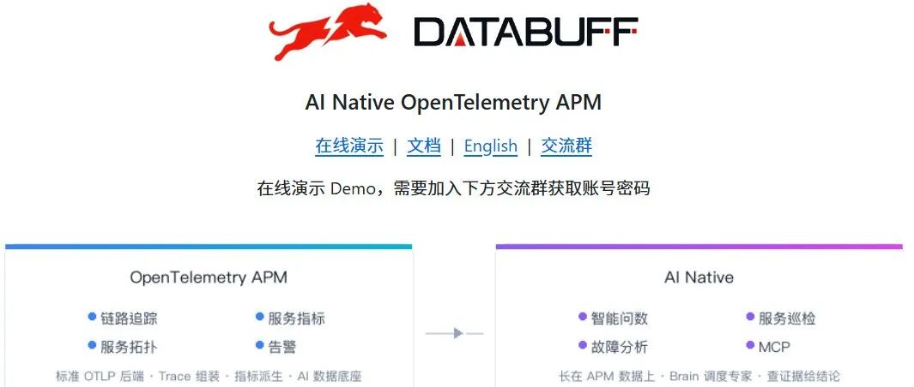
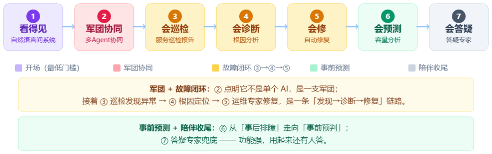
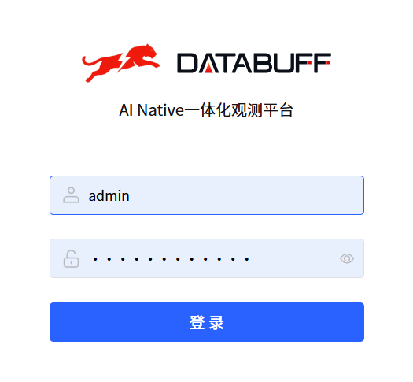
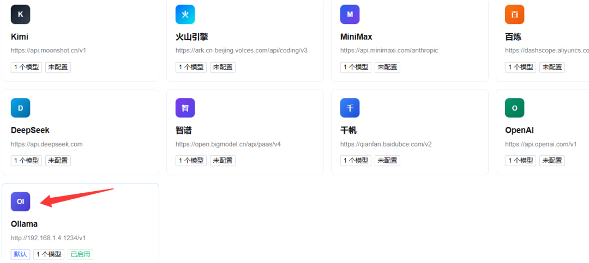
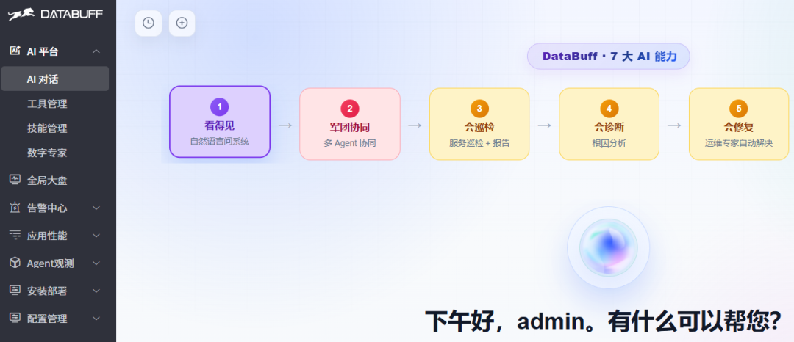
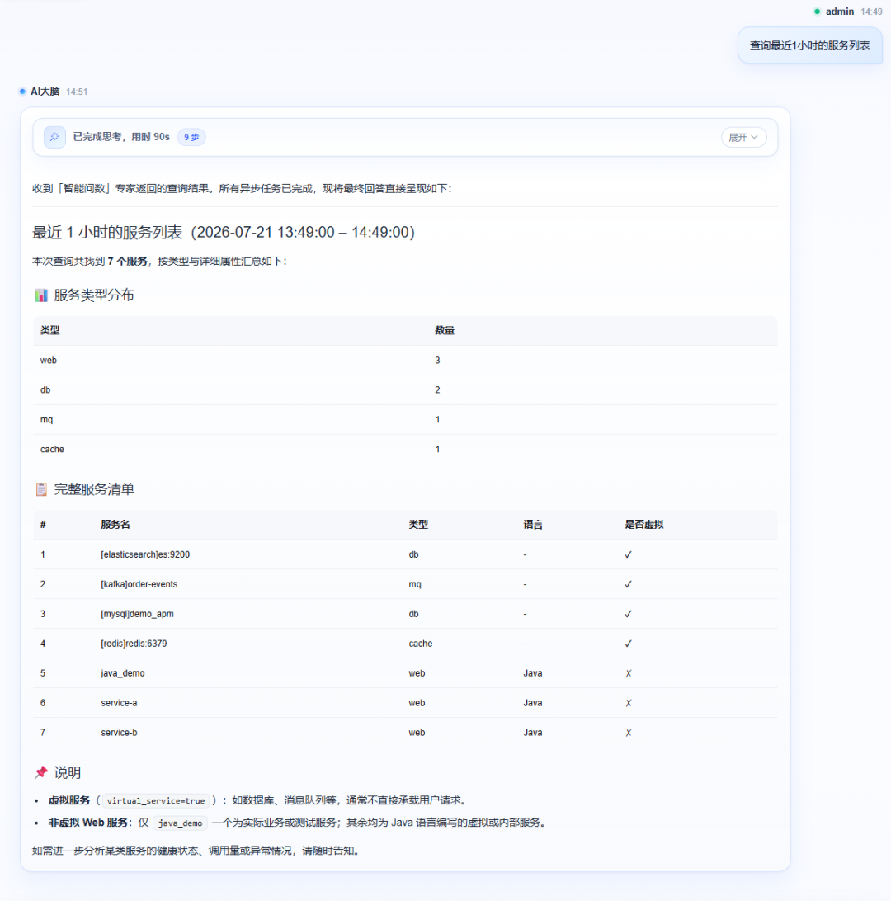
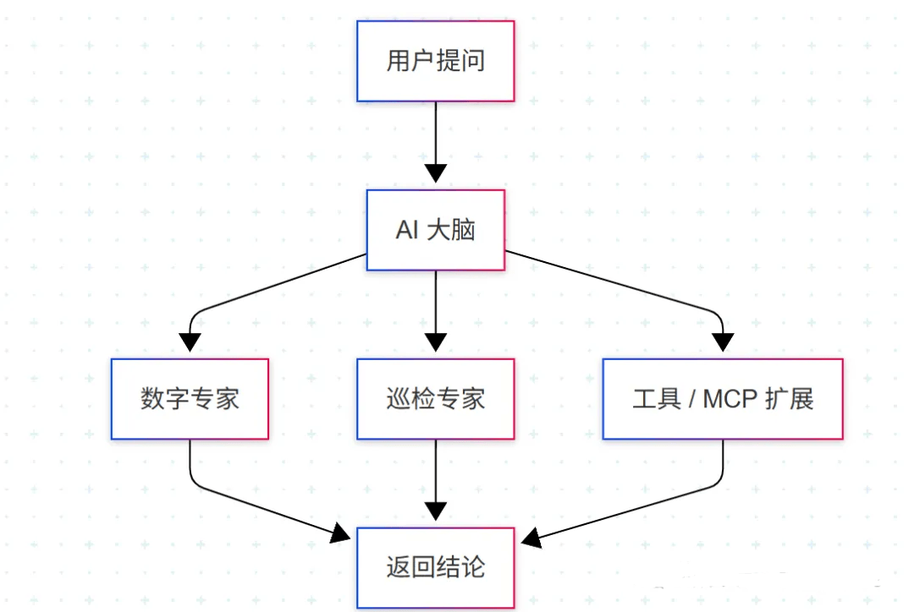

> 统一可观测性时代已来，再也不用在 Grafana、Jaeger、ELK 之间来回切屏了。

DataBuff 是由 DataBuff Labs 开源的一体化可观测性平台，将 Metrics / Traces / Logs / Events 四大信号原生打通，提供开箱即用的全功能 Web UI，替代多工具拼凑。GitHub: github.com/databufflabs/databuff（Apache-2.0）。

---

## 一、核心功能一览

| 功能 | 说明 |
|------|------|
| **统一数据模型** | 自动关联 Metrics、Traces、Logs——在慢链路下钻相关日志和主机指标，上下文一气呵成 |
| **全功能 Web 仪表盘** | 时序图、统计表、拓扑图、火焰图、日志列表，拖拽式布局自定义大盘 |
| **智能告警引擎** | 阈值/同环比/聚合/静默/分级告警，通知支持邮件、钉钉、飞书、企微、Webhook |
| **兼容 OpenTelemetry** | 完全兼容 OTLP 协议，Java/Go/Python/Node.js 应用直接接入，迁移成本极低 |
| **高性能存储** | 自研时序存储引擎 + 列式日志存储，写入/查询远超通用数据库，支持 PB 级扩展 |
| **多租户** | 天然支持按团队/环境隔离，适合中大型组织统一建设可观测性底座 |



## 二、环境说明

| 节点 | IP | OS | 配置 | 职责 |
|------|-----|-----|------|------|
| DataBuff 服务器 | 192.168.52.138 | openEuler | 8核16G | 安装 DataBuff 平台 |
| K8s 服务器 | 192.168.52.129 | openEuler | 8核16G | 已有 Prometheus/Grafana/Loki/Tempo + java-demo 应用（OpenTelemetry 链路追踪） |

目标：将 K8s 应用的日志、链路追踪数据传输至 DataBuff 服务器，进行 AI 分析。

## 三、DataBuff 部署

### 离线安装

由于镜像较大（3.54GB），推荐离线安装：

```bash
# 下载离线包（推荐迅雷）
# 解压并安装
tar -zxvf databuff-ai-apm-offline-0.1.4-amd64.tar.gz
cd databuff-ai-apm-offline-0.1.4-amd64
./install.sh
```

等待约 10 分钟，安装完成输出：

```
Web UI     http://192.168.52.138:27403
账号       admin / Databuff@123
Ingest     http://192.168.52.138:4318/v1/traces
安装目录   /opt/databuff-ai-apm
```



### AI 模型配置

首次登录需配置 AI 模型，支持多种模型接入。文章使用本地 LM Studio 启动的 `qwen3.5-4b` 模型：



## 四、接入 K8s 数据

在已有的 OpenTelemetry Collector 配置中，增加 DataBuff 作为额外的 exporter：

```yaml
# 在 exporters 中添加
otlphttp/databuff:
  endpoint: http://192.168.52.138:4318
  tls:
    insecure: true
  compression: none      # ⚠️ 必须关闭压缩，否则数据接收异常

# 在 pipelines 中，每个 pipeline 追加 databuff exporter
traces:
  exporters: [otlp/tempo, otlphttp/databuff]
logs:
  exporters: [otlphttp/loki, otlphttp/databuff]
metrics:
  exporters: [prometheusremotewrite, otlphttp/databuff]
```

> **关键坑：** `compression: none` 必须设置。默认 OTel Collector 开启压缩，但 DataBuff 接收时会异常导致发送失败。

重新应用配置后等待约 10 分钟，刷新 DataBuff 页面即可看到 `java_demo` 服务。

## 五、Demo 应用

一键部署 DataBuff 示例应用：

```bash
curl -fsSL https://databuff.ai/databuff/ai-apm-demo-install.sh | bash
```

部署后需修改环境变量指向 DataBuff 服务器：

```bash
kubectl -n databuff edit deployment ai-apm-demo
# 修改 OTEL_EXPORTER_OTLP_ENDPOINT 为 http://192.168.52.138:4318
```

验证日志显示 `OTLP traces sent` 即为成功。



## 六、AI 工作台

DataBuff 的 AI 工作台不是简单聊天机器人——背后连接的是真实 APM 数据：Trace 调用链、服务指标、全局拓扑、告警事件、数据库/缓存/MQ 组件调用。

### 场景 1：巡检

```
帮我巡检一下最近 1 小时的核心服务，看看有没有异常。
```

AI 会巡检所有服务，给出详细巡检报告，告知是否需要进一步排查。



### 场景 2：慢 Trace 定位

```
帮我找最近 30 分钟最慢的 5 条 Trace，并说明主要耗时在哪个服务或组件。
```

AI 直接返回最慢 Trace、耗时分布、瓶颈分析，无需手动筛选。

### 场景 3：慢 SQL 查找

```
帮我找最近 1 小时调用次数最多、耗时最高的慢 SQL。
```

直接从 Trace 中提取数据库 Span，定位慢 SQL，规避传统"接口慢→开 Trace→找 DB Span→交叉验证"的多步流程。

### 更多场景

- 自动生成事故复盘
- 自动写巡检日报
- 检查服务健康状态
- 推荐提问列表：
  ```
  汇总最近1小时系统健康情况？
  哪个服务错误率最高？
  Redis有没有异常？
  Kafka消费正常吗？
  帮我写事故复盘。
  ```



---

## 战略分析

**DataBuff 定位：** 这是一个对标 Datadog/Grafana Cloud 的开源替代方案，核心差异点在于"原生统一"（而非 Grafana 的插件拼接）和"AI 工作台"（将 AI 嵌入运维工作流，而非独立对话机器人）。

**与 Hermes 体系的关系：**
DataBuff 是**基础设施可观测性**层工具，Hermes 是**Agent 编排**层工具，二者处于不同抽象层级，不存在直接竞争或替代关系。但 DataBuff 的 AI 工作台设计思路值得关注：

- **数据驱动的 AI 交互**：DataBuff 的 AI 不是通用聊天，而是"背后连真实 APM 数据"的上下文注入模式——这正是 Hermes 的 cronjob + skill 体系可以借鉴的：让 cronjob 定时抓取系统状态，注入到技能上下文中驱动巡检/报告生成
- **自然语言替代多页面操作**：DataBuff 验证了一个趋势——运维/监控领域正在从"UI 点击流"转向"一句话问答"，Hermes 的 Telegram/微信通道天然适合这类场景
- **安装门槛**：3.54GB 离线包 + 8核16G 最低配置，对于个人开发者偏重，更适合团队/公司统一建设

## 链接

- GitHub: [github.com/databufflabs/databuff](https://github.com/databufflabs/databuff)
- 官网: [https://databuff.ai](https://databuff.ai)

## 归档日志

- 2026-07-22 归档
