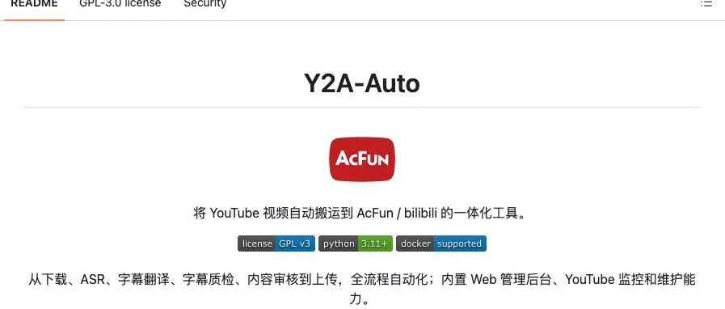
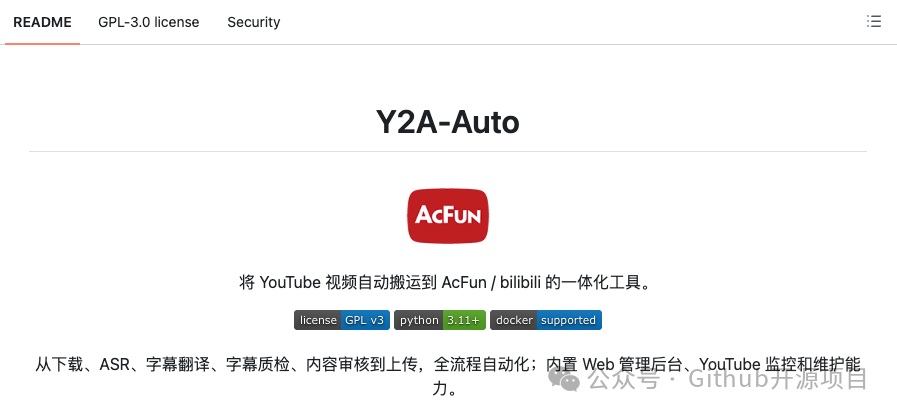
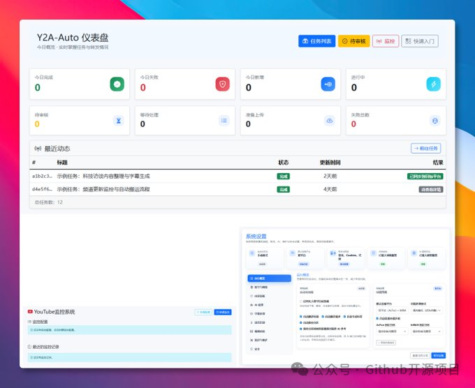

## 概述

Y2A-Auto 是一个开源自动化流水线工具，从 YouTube 链接一键完成视频下载、ASR 语音识别、AI 翻译、字幕质检、标题简介生成，最终自动上传到 AcFun 和 B 站。项目由个人开发者 fqscfqj 维护，部署推荐 Docker。

## 核心功能

| 功能 | 说明 |
|------|------|
| 全自动流水线 | 丢 YouTube 链接 → 下载 (yt-dlp) → ASR (Whisper/Voxtral) → 翻译 → 字幕质检 → 上传 B 站/A 站 |
| 人工审核模式 | 支持卡在翻译/标题/分区环节人工调整后再发布，非完全"黑盒"自动化 |
| 频道定时监控 | 按 YouTube 频道或关键词监控，新视频自动入队 |
| 任务通知 | 成功/失败推送企业微信、Server酱等渠道 |
| 生产级兜底 | H.265 编码失败自动回退 H.264；并发的任务队列控制；日志周期性清理 |



## 部署与配置

```bash
docker compose up -d
```

启动后访问 `localhost:5000`，配置：
- YouTube Cookie（扫码登录或 CookieCloud 同步）
- B 站 / A 站平台账号
- AI 接口（翻译用）

项目内置了扫码登录、CookieCloud、日志清理、并发控制、H.265 失败回退 H.264 等生产级兜底逻辑。



## 关键洞察

- 作者明显了解运营搬运场景的真实痛点——不是"有没有工具"，而是"工具的异常处理够不够硬"。Cookie 过期、转码失败、日志膨胀这些实际运维问题是比功能罗列更重要的工程考量。
- "搬运不是复制粘贴"——这是文章最清醒的一句话。原作者授权、平台转载规则、AI 翻译人工复核（人名、术语、时间轴）仍是必须由人兜底的部分。
- 适合场景：公开授权内容（CC 协议、开源项目演示）的本地化搬运；不适合直接用未授权内容做所谓"躺赚"。

## 战略分析

**与 Hermes 体系的关联：**

Y2A-Auto 解决的是一个垂直自动化场景（视频搬运流水线），而 Hermes Agent 是通用 AI 任务编排引擎。两个工具在能力上有潜在交集：

- Hermes 已有 `youtube-content` skill 可提取 YouTube 字幕 → 摘要/推文/博客，Y2A-Auto 的 ASR+翻译管线则更进一步（多语言翻译、硬字幕烧录、跨平台投稿）
- 如果要为 Hermes 补充视频内容处理能力，Y2A-Auto 的模块化架构（yt-dlp → ASR → 翻译 → 上传）是很好的参考范式
- 目前 Hermes 的 `video_transcriber` 工具集已经覆盖了 Bilibili/YouTube/Douyin 的 ASR 转录，缺少的是自动翻译和跨平台投稿环节——Y2A-Auto 恰好补上了这两块

**当前能力差距：**

| 维度 | Y2A-Auto | Hermes 体系 |
|------|----------|-------------|
| ASR 转录 | Whisper + Voxtral (双引擎) | faster-whisper tiny (单一引擎) |
| 翻译 | AI 翻译管道 | 无专用翻译模块 |
| 字幕处理 | 字幕质检 + 硬字幕烧录 | 无 |
| 投稿发布 | B 站 + A 站自动上传 | 无 |
| 通知 | 企业微信 + Server酱 | cronjob 可做但无原生通知 |
| 部署 | Docker Compose | 无打包部署方案 |

总体上 Y2A-Auto 是一个高度专精的视频搬运工具，与 Hermes 的视频转录能力互补但不重叠。未来若需要为 Hermes 增加"从原始视频到多语言发布"的完整能力，Y2A-Auto 的架构设计和异常处理逻辑是值得参考的实现蓝本。

## 链接

- GitHub: [github.com/fqscfqj/Y2A-Auto](https://github.com/fqscfqj/Y2A-Auto)

## 归档日志

- 2026-07-22 归档
