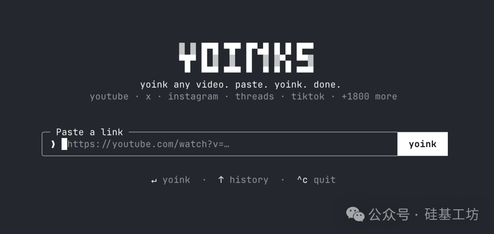
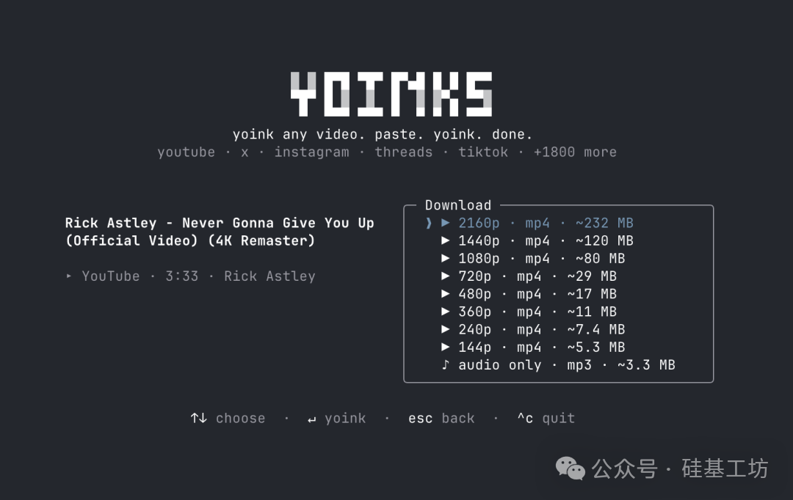

## 概述

yoinks（npm: `yoinks`）是一个基于终端 UI 框架 Ink（React for Terminal）构建的全屏视频下载工具。核心依赖 yt-dlp（1800+ 网站解析支持），提供全屏 TUI 交互界面——粘贴链接→选清晰度→直接下载，无需广告、弹窗或假下载按钮。

GitHub: github.com/pablostanley/yoinks

## 核心功能

### 一键安装

```bash
npm install -g yoinks    # 全局安装
npx yoinks               # 或临时使用
```

要求 Node 18+。首次运行自动下载 yt-dlp 二进制和 ffmpeg。

### 使用方式

```bash
yoinks https://youtu.be/dQw4w9WgXcQ    # 直接传链接
yoinks                                  # 交互式输入
```



全屏 TUI，**↑/↓/j/k** 键盘导航 + 鼠标点击支持，每个清晰度选项带预估文件大小，支持一键切换 MP3 纯音频，按 `^t` 即时切换主题色（auto/light/dark）。



### 技术栈

| 组件 | 说明 |
|------|------|
| **yt-dlp** | 内核引擎，1800+ 网站反爬解析规则，YouTube/Twitter/Instagram/TikTok 全覆盖 |
| **Ink** | React for Terminal 框架，全屏模式、键盘导航、鼠标支持、主题切换 |
| **ffmpeg** | 视频流+音频流合并，内置 `ffmpeg-static` fallback |

### 与原生 yt-dlp 对比

| 维度 | yt-dlp 原生 | yoinks |
|------|-------------|--------|
| 交互方式 | 命令行参数 | 全屏 TUI，鼠标+键盘 |
| 格式选择 | `-F` 列列表 → `-f` 指定编号 | 界面点选 |
| 文件大小预览 | ❌ | ✅ 每个选项带大小估算 |
| 主题/视觉 | 纯文本 | 全屏 UI，3 种主题 |
| MP3 提取 | 手动传参 | 一键切换 |
| 安装 | Python + pip | npm install 一步到位 |

### 局限性

- 依赖 yt-dlp，下载速度取决于本地带宽（非在线站点的服务器端缓存）
- 需 Node 18+，老系统不支持
- 暂不支持播放列表/多视频下载（Roadmap 中）
- 暂不支持 `--best` 跳过选择模式（Roadmap 中）

## 关键洞察

yoinks 不是技术创新——本质是"给 yt-dlp 包了一层精美 TUI 的前端工具"。但好的工具不是功能堆砌，而是把复杂底层能力用最简单的交互暴露出来。项目 fair use 声明写得很坦诚：个人归档工具，请只下载你有权保留的内容。

## 战略分析

**与 Hermes 体系的关联：**

yoinks 与 Hermes 的 `video_transcriber` 工具集共享同一个核心依赖（yt-dlp），但解决的问题不同：

| 维度 | yoinks | Hermes video_transcriber |
|------|--------|--------------------------|
| 定位 | 交互式手动下载器 | 自动化 ASR 转录管线 |
| 界面 | 全屏 TUI（Ink） | CLI 脚本 + API 调用 |
| 下载策略 | 用户选择清晰度 | 自动选最低带宽音频流 |
| 输出 | 视频/音频文件 | 转录文本 |
| 安装 | npm install | Python pip + 系统依赖 |

yoinks 的 **Ink (React for Terminal)** 技术选型值得注意——Hermes 目前使用自己的 TUI 框架（`hermes-app`），Ink 作为成熟的全屏 TUI 方案（React 组件模型）是值得参考的。如果未来 Hermes 需要在终端提供更丰富的交互界面（如视频选择菜单、配置向导），Ink 是一个轻量好用的备选。

## 链接

- GitHub: [github.com/pablostanley/yoinks](https://github.com/pablostanley/yoinks)
- npm: `npm install -g yoinks`

## 归档日志

- 2026-07-22 归档
