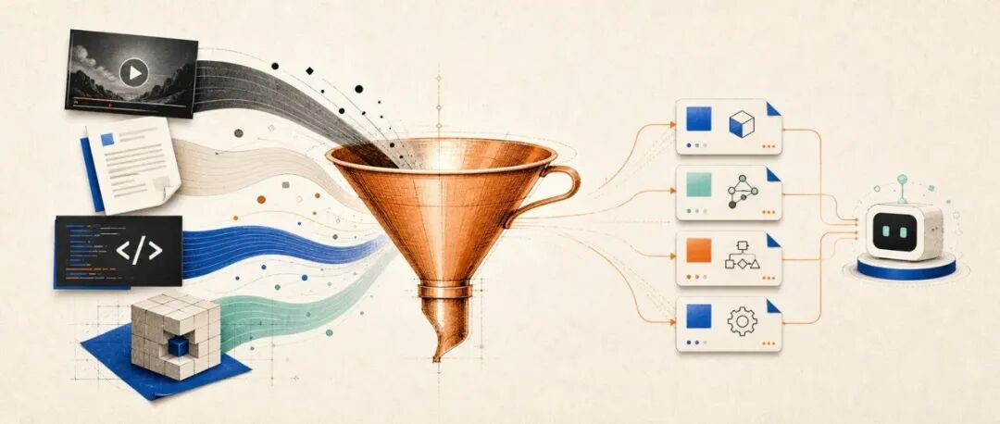
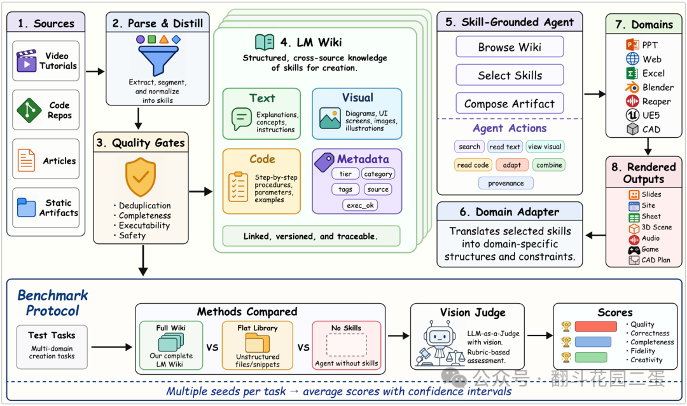
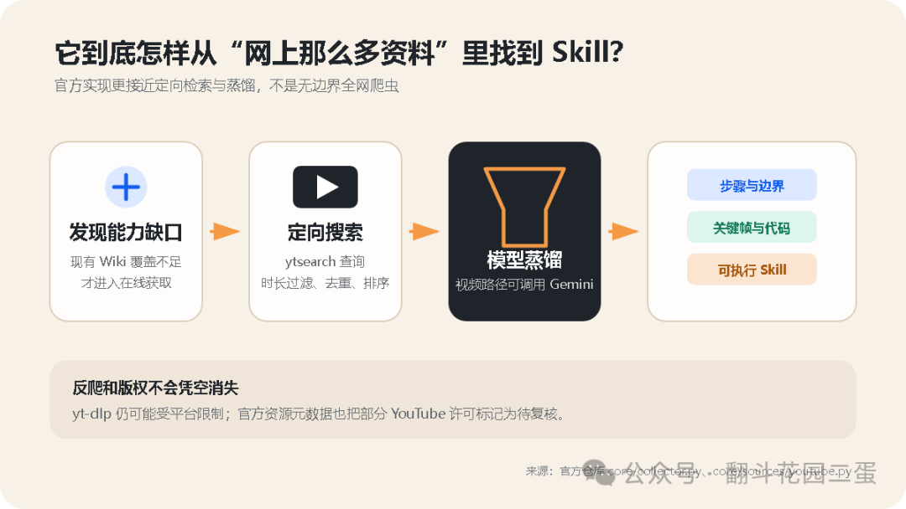
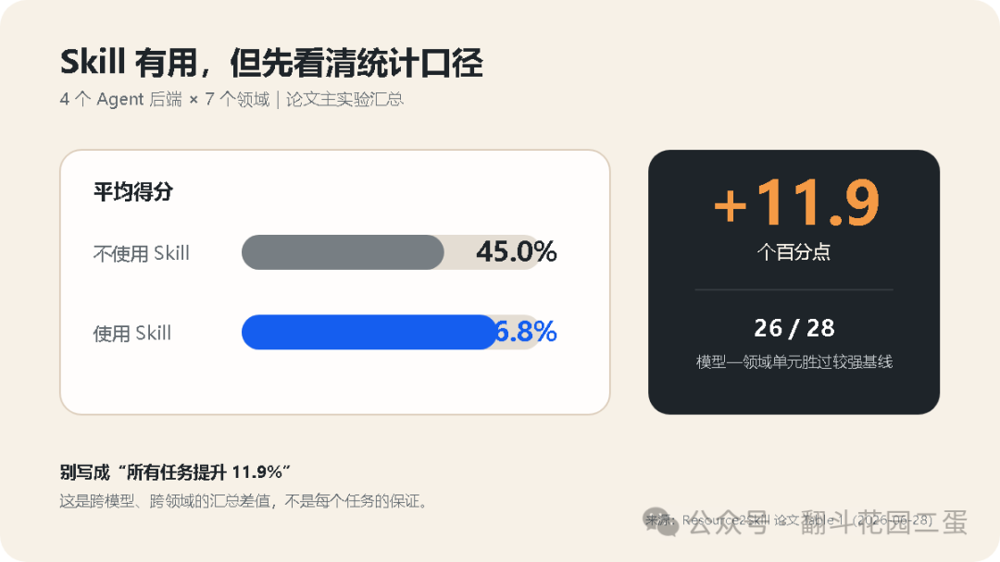
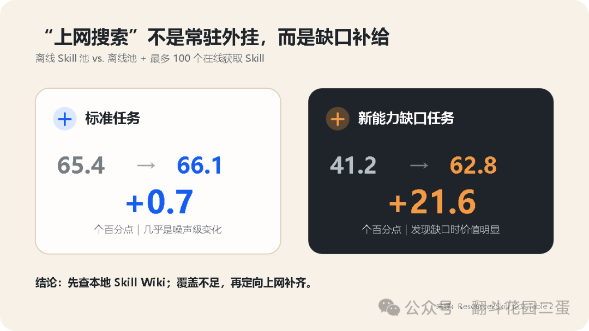

## 概述

微软开源的 Resource2Skill（github.com/microsoft/Resource2Skill）是一套把人类已有资源（教程视频、代码、文档、参考产物）"蒸馏"成 Agent 可执行 Skill 的系统。论文作者来自微软、UCSC 和上海交大，2026年6月预印本。

**核心定位：** 它不是一个新模型 / Skill 商店 / 超级爬虫。它是一座 Skill 工厂——把已经存在的操作经验（视频演示、代码、文章、产物）提炼成 Agent 能检索、组合和执行的程序性知识。

## 核心流水线：五步蒸馏

1. **发现资源**：围绕领域/能力搜索视频、代码、文章与参考产物
2. **蒸馏经验**：识别任务步骤、工具调用、关键参数、失败条件、验收方式
3. **组织成 Wiki**：按能力层级组织 Skill（非平铺文件夹）
4. **选择与组合**：Agent 先浏览层级，再挑选少量相关 Skill
5. **执行与补缺**：Skill 不够时触发在线获取

输出不是"视频摘要"，而是告诉 Agent：**下一步做什么、用什么工具、做到什么程度、失败了怎么办**。文字+视觉关键帧+代码片段融入同一份 Skill 表征。

## 五层价值（作者的深度分析）

### 第一层：隐性经验→团队资产
"最佳实践"不在知识库，而在同事的视频、成功提交、交付文件和"这里千万别这么配"的口头提醒里。Resource2Skill 想把材料里的动作、顺序、边界和验收标准提出来。

### 第二层：压缩运行时上下文
普通 RAG 塞多篇文档给模型临场判断；Skill Wiki 提前做好阅读和组织。论文选择实验证实：随机把整个 Skill 池丢给 Agent 效果仅略高于无 Skill，层级浏览+模型选择才显著提升。

### 第三层：经验与模型适度解耦
Skill 把工具步骤、检查点、产物要求放到模型之外，同一份 Skill 可被不同 Agent 后端复用。但非完全解耦——不同模型使用同一 Skill 的效果仍有差异。

### 第四层：可评测性
论文做同题对比：Skill 池规模、来源、表征、选择策略、在线获取——逐项消融。一个 Skill 不是写完进祖传目录，而是固定任务比对，不好就修改/降级/删除。

### 第五层：在线缺口补给
不是每次任务都重新上网学习。标准任务在线获取只提升 +0.7pp，新能力缺口任务却提升 +21.6pp。正确顺序：先复用离线 Skill→确认覆盖不足→带着明确问题去找。

## 资源发现机制

不是全互联网扫描。以视频为例：生成搜索词→`yt-dlp` ytsearch→按时长/标题/频道/播放量筛选→去重→Gemini 分析+抽取关键帧。

**约束：** 反爬限制、频率策略、区域封锁照样存在；能看≠能炼，复用到的 YouTube 来源带 `youtube_review_pending` 许可复核标记。

## 成本与模型选择

官方默认：视频分析接 Google Gemini API（倾向 2.5 Flash 而非 Pro，"Pro 对批量太贵"）。完整流水线的成本来自：
- 长视频/多模态的模型分析
- 大量资源的反复蒸馏、纠错与结构化生成
- 最终执行 Skill 的 Agent 模型

**不是纯本地、纯免费的。** 可改本地模型，但需替换模型适配层且保证长上下文+视频理解+代码理解+稳定结构化输出能力。

## 论文结果

| 指标 | 数值 |
|------|------|
| 无 Skill 基线 | 45.0% |
| 使用 Resource2Skill | 56.8%（+11.9pp） |
| 28个比较单元中超越强基线 | 26个 |
| GPT-5.4 七领域平均 | 51.9→66.9（+15.0pp） |
| UE5 领域最大提升 | 29.1→67.3（+38.2pp） |
| 人类A/B盲测偏好（带Skill） | 85.5% |

**关键发现：** Skill 的价值与模型原本会不会、任务能否被明确描述高度相关。UE5 这类工具链复杂、步骤依赖强的任务受益最大；模型已熟悉的任务收益有限。

## 关键洞察

### 在线获取 = 缺口补给，不是常驻外挂

- 标准任务：+0.7pp（离线池已覆盖）
- 新能力缺口：+21.6pp（现有库完全没学过）

### Skill 不是越多越好
0→200 个收益最大，此后逐渐饱和。400→完整池最多再 +0.8pp。前两百条解决覆盖问题，后面开始解决重复/冲突/检索噪声。

### 视频是关键来源
四类来源全用平均 68.9，去掉视频降到 59.4。大量 GUI 操作、时序动作和微妙参数只存在于演示过程中。

### 与 Skill Creator 的区别

| 维度 | Resource2Skill | Skill Creator |
|------|---------------|---------------|
| 起点 | 视频、代码、文档、产物 | 明确任务/人工意图 |
| 核心工作 | 发现→蒸馏→组织→检索→组合 | 定义触发→编写→验证→迭代 |
| 产物 | 候选 Skill 库与 Wiki | 工程化打磨后的 Skill |

**资源2Skill 找矿选矿炼毛坯 → Skill Creator 精加工验收装进工具箱**

## 战略分析

**这是对 Hermes Agent 技能体系最直接相关的外部研究。**

Resource2Skill 与 Hermes 面临同一个核心问题——**Agent 的 Skill 从哪里来**——但走了完全不同的路径：

| 维度 | Resource2Skill | Hermes Agent |
|------|---------------|--------------|
| **Skill来源** | 从外部资源（视频/代码/文档）自动蒸馏 | 人工编写 SKILL.md + 脚本 |
| **组织方式** | 层级 Wiki（能力树） | 扁平 skill 列表 |
| **选择机制** | Agent 先浏览层级再选择 | 手动触发/技能名匹配 |
| **在线补缺** | 自动触发（+21.6pp） | 无 |
| **评测** | 同题消融实验（固定任务+盲测） | 无结构化评测 |
| **多模态** | 文字+视觉关键帧+代码 | 纯文本 |
| **资源利用** | 利用已有教程/代码/产物 | 仅依赖人工经验 |

**Hermes 可以借鉴的点：**

1. **Skill Wiki 层级组织**——目前 Hermes 的 skill 是平铺列表，Resource2Skill 的层级浏览+选择效果显著优于全量注入。Hermes 可以考虑给 skill 加领域/层级元数据，让 Agent 先缩小范围再选 skill。

2. **"A/B 评测"机制**——论文用固定任务+盲测验证 Skill 效果。Hermes 缺少"这个 Skill 有没有用"的量化判断。可以给每个 skill 加一个评测任务集，cronjob 定时跑。

3. **在线缺口补给**——当 Agent 遇到 Hermes 现有 skill 未覆盖的任务时，自动搜索外部资源（教程/文档）蒸馏为新 skill。这是 Resource2Skill 最核心的能力，也是 Hermes 目前完全缺失的。

4. **资源的多元利用**——Hermes 的 `video_transcriber` 已覆盖 ASR 转录，但仅提取文字。可以扩展为从视频中提取操作步骤（类似 Resource2Skill 的视频蒸馏），把 YouTube/Bilibili 教程自动变成 skill。

**限制：** Resource2Skill 依赖云端模型（Gemini）做视频分析，成本较高；资源发现的版权和隐私问题需人工把控；目前更适合组织级（多项目/多模型）而非个人使用。

## 作者本地试验结论

作者在多项目仓库做了隔离小样本试验（A/B 盲测），结果：
- 没有"一装 Skill 原地飞升"的戏剧性
- 真正改善的三件事：**边界更清楚、步骤更一致、验收更具体**
- 最务实的建议：先找一个高频、稳定、可验收的流程，炼出第一个 Skill

## 链接

- GitHub: [github.com/microsoft/Resource2Skill](https://github.com/microsoft/Resource2Skill)
- 论文: [arxiv.org/abs/2606.29538](https://arxiv.org/abs/2606.29538)
- 项目页: [waltstephen.github.io/Resource2Skills](https://waltstephen.github.io/Resource2Skills/)
- 数据集: [huggingface.co/datasets/microsoft/RESOURCE2SKILL](https://huggingface.co/datasets/microsoft/RESOURCE2SKILL)

## 归档日志

- 2026-07-22 归档
